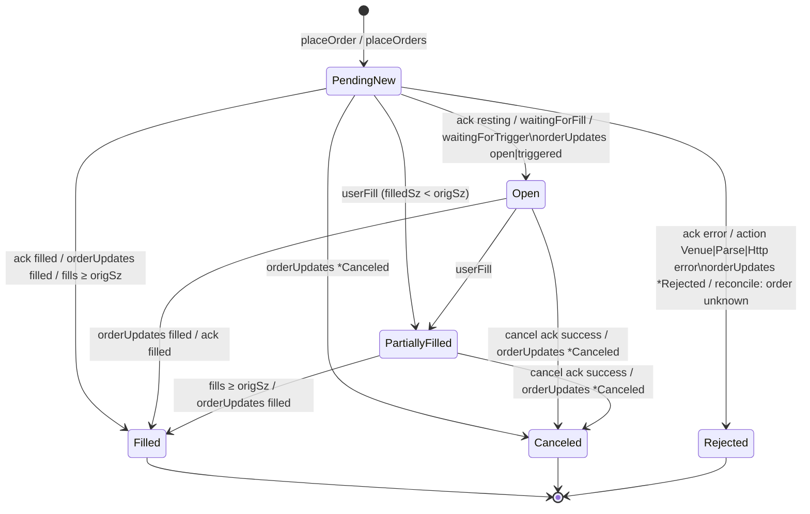

# hyperliquid-cpp — API Reference

Version 1.2.0 · C++20 · Linux (epoll) · namespace `hl`

This document describes every public type and function of the library as declared under
`include/hl/`. Behaviour notes describe what the implementation actually does; where the venue
(Hyperliquid) imposes rules, they are called out explicitly.

---

## Table of contents

1. [Overview and conventions](#1-overview-and-conventions)
   - [1.1 Headers](#11-headers)
   - [1.2 Threading model](#12-threading-model)
   - [1.3 Lifetimes of views and pointers](#13-lifetimes-of-views-and-pointers)
   - [1.4 Error model](#14-error-model)
   - [1.5 Exceptions](#15-exceptions)
2. [Core types](#2-core-types)
   - [2.1 Decimal](#21-decimal)
   - [2.2 RoundingMode and roundToQuantum](#22-roundingmode-and-roundtoquantum)
   - [2.3 Types.h — Network, Side, Tif, Address, Cloid, Error](#23-typesh--network-side-tif-address-cloid-error)
   - [2.4 Result&lt;T&gt;](#24-resultt)
   - [2.5 Logging](#25-logging)
   - [2.6 Hex helpers, Int128, Version](#26-hex-helpers-int128-version)
3. [EventLoop](#3-eventloop)
4. [Market data](#4-market-data)
   - [4.1 MarketDataConfig and L2BookOptions](#41-marketdataconfig-and-l2bookoptions)
   - [4.2 MarketDataListener](#42-marketdatalistener)
   - [4.3 MarketDataClient](#43-marketdataclient)
   - [4.4 OrderBook](#44-orderbook)
   - [4.5 Message structs (WsMessages.h)](#45-message-structs-wsmessagesh)
   - [4.6 WsMessageHandler and WsMessageParser](#46-wsmessagehandler-and-wsmessageparser)
5. [Order management](#5-order-management)
   - [5.1 ExchangeConfig and ActionTransport](#51-exchangeconfig-and-actiontransport)
   - [5.2 OrderState and the order state machine](#52-orderstate-and-the-order-state-machine)
   - [5.3 Order and OrderRequest](#53-order-and-orderrequest)
   - [5.4 ExchangeListener](#54-exchangelistener)
   - [5.5 ExchangeClient](#55-exchangeclient)
   - [5.6 InfoClient](#56-infoclient)
   - [5.7 AssetRegistry and AssetInfo (price/size rules)](#57-assetregistry-and-assetinfo-pricesize-rules)
   - [5.8 Account and order data types (om/Types.h)](#58-account-and-order-data-types-omtypesh)
   - [5.9 ExchangeResponse](#59-exchangeresponse)
   - [5.10 Rate limits and request budget](#510-rate-limits-and-request-budget)
6. [Signing and low-level actions](#6-signing-and-low-level-actions)
   - [6.1 Signer, actionHash, agentDigest](#61-signer-actionhash-agentdigest)
   - [6.2 Keccak256](#62-keccak256)
   - [6.3 MsgPackWriter](#63-msgpackwriter)
   - [6.4 Wire structs](#64-wire-structs)
   - [6.5 actions:: builders](#65-actions-builders)
   - [6.6 NonceGenerator](#66-noncegenerator)
   - [6.7 RequestBuilder](#67-requestbuilder)
   - [6.8 Standalone signing example](#68-standalone-signing-example)
7. [Transport](#7-transport)
   - [7.1 WsSession](#71-wssession)
   - [7.2 WebSocketClient](#72-websocketclient)
   - [7.3 TlsStream and TlsOptions](#73-tlsstream-and-tlsoptions)
   - [7.4 HttpClient](#74-httpclient)
   - [7.5 HttpResponseParser](#75-httpresponseparser)
   - [7.6 WebSocket frame codec](#76-websocket-frame-codec)
   - [7.7 Url](#77-url)
8. [Recipes](#8-recipes)
9. [Error and rejection reference](#9-error-and-rejection-reference)
10. [Limits and venue notes](#10-limits-and-venue-notes)

---

## 1. Overview and conventions

hyperliquid-cpp is a self-contained C++20 connector for Hyperliquid:

- **Market data** — public WebSocket feeds (`l2Book`, `bbo`, `trades`, `activeAssetCtx`, `allMids`, any raw
  subscription), an allocation-free JSON decoder and a maintained L2 `OrderBook` per coin.
- **Order management** — EIP-712 / secp256k1 signing byte-identical to the official Python SDK, order entry over
  WebSocket `post` or HTTP, a consolidated order table driven by acknowledgements, `orderUpdates` and `userFills`,
  position tracking and automatic reconciliation.
- **Transport** — a single-threaded epoll reactor, non-blocking TLS, RFC 6455 WebSocket, HTTP/1.1 keep-alive.

Everything lives in namespace `hl`. No third-party header is visible in a public header: the API uses the C++
standard library plus two opaque forward declarations (`struct ssl_ctx_st`, `struct secp256k1_context_struct`).
OpenSSL, simdjson and libsecp256k1 are all linked privately, so they are resolved for you at link time but their
include paths are not added to your target.

### 1.1 Headers

| Header | Contents |
|---|---|
| `hl/hyperliquid.h` | Umbrella header — includes every public header below |
| `hl/Version.h` | `kVersionMajor`, `kVersionMinor`, `kVersionPatch`, `kVersionString` |
| `hl/core/Decimal.h` | `Decimal`, `RoundingMode`, `roundToQuantum`, `operator<<` |
| `hl/core/Types.h` | `Network`, `restUrl`, `wsUrl`, `Side`, `opposite`, `Tif`, `isValidCoinName`, `Address`, `parseAddress`, `toHex`, `Cloid`, `CloidHash`, `Error` |
| `hl/core/Result.h` | `Result<T>` |
| `hl/core/Log.h` | `LogLevel`, `LogSink`, `setLogSink`, `setLogLevel`, `logLevel`, `logf` |
| `hl/core/Hex.h` | `toHex(bytes)`, `hexNibble`, `stripHexPrefix`, `fromHex` |
| `hl/core/Int128.h` | `Int128` |
| `hl/net/EventLoop.h` | `EventLoop`, `IoHandler` |
| `hl/WsMessages.h` | Decoded message structs, `OrderUpdateStatus`, `WsMessageHandler` |
| `hl/WsMessageParser.h` | `WsMessageParser` |
| `hl/md/MarketDataClient.h` | `MarketDataConfig`, `L2BookOptions`, `MarketDataListener`, `MarketDataClient` |
| `hl/md/OrderBook.h` | `OrderBook` |
| `hl/om/ExchangeClient.h` | `ExchangeConfig`, `ActionTransport`, `OrderState`, `Order`, `OrderRequest`, `ExchangeListener`, `ExchangeClient` |
| `hl/om/InfoClient.h` | `InfoClient` |
| `hl/om/AssetRegistry.h` | `AssetInfo`, `AssetRegistry` |
| `hl/om/Types.h` | `Fill`, `OpenOrder`, `OrderStatusInfo`, `Position`, `AccountState`, `SpotBalance`, `RateLimitStatus`, `Candle`, `FundingRate`, `PredictedFunding`, `FundingPayment`, `PerpContext`, `UserRole`, `L2Snapshot` |
| `hl/om/ExchangeResponse.h` | `ActionStatus`, `ExchangeResponse`, `parseExchangeResponse` |
| `hl/om/Actions.h` | `TriggerSpec`, `OrderWire`, `Grouping`, `groupingWire`, `PriorityRate`, `OrderGrouping`, `BuilderFee`, `CancelWire`, `CancelByCloidWire`, `ModifyWire`, `EncodedAction`, `actions::*`, `NonceGenerator`, `RequestBuilder` |
| `hl/om/MsgPack.h` | `MsgPackWriter` |
| `hl/crypto/Keccak.h` | `Hash256`, `Keccak256`, `keccak256` |
| `hl/crypto/Signer.h` | `Signature`, `actionHash`, `agentDigest`, `Signer` |
| `hl/net/WsSession.h` | `WsSessionOptions`, `WsSessionListener`, `WsSession` |
| `hl/net/WebSocketClient.h` | `WebSocketListener`, `WebSocketOptions`, `WebSocketClient` |
| `hl/net/TlsStream.h` | `TlsOptions`, `TlsStreamListener`, `TlsStream` |
| `hl/net/HttpClient.h` | `HttpClientOptions`, `HttpClient` |
| `hl/net/HttpCodec.h` | `HttpResponse`, `HttpResponseParser` |
| `hl/net/WsCodec.h` | `WsOpcode`, `encodeWsFrame`, `WsFrameSink`, `WsFrameDecoder`, `wsAcceptKey`, `base64Encode` |
| `hl/net/Url.h` | `Url` |

The umbrella header `hl/hyperliquid.h` includes every header listed above.

### 1.2 Threading model

- Every client (`MarketDataClient`, `ExchangeClient`, `InfoClient`, `WsSession`, `HttpClient`, …) is bound to one
  `EventLoop` and **must only be used from the thread that runs that loop**.
- All callbacks — listener methods, `Result` callbacks, timers, posted tasks — execute on the loop thread, from
  inside `EventLoop::run()` / `runOnce()`.
- The only thread-safe entry points are `EventLoop::postThreadSafe()`, `EventLoop::stop()` and
  `EventLoop::stopped()`. To place an order from another thread, post a task (see [Recipe 8.6](#86-dedicated-pinned-loop-thread-orders-from-another-thread)).
- The only thread the library ever starts is the optional nonce-pool refill thread (`Signer::enableNoncePool`,
  `ExchangeConfig::precomputedNonces`); it touches nothing but the pool.
- `Signer` signing methods are `const` and may be called concurrently; `NonceGenerator::next()` is lock-free and
  thread-safe; `setLogSink` / `setLogLevel` are atomic.
- `WsMessageParser` is not thread-safe — one parser per thread.

**What a callback may do.** Calling back into the client from its own listener (e.g. `placeOrder` inside
`onOrderUpdate`) is supported, and so is **running the event loop re-entrantly** — the "wait until my order
rests" idiom:

```cpp
void onFill(const hl::Fill&) override {
    ex->placeOrder(req);                 // fine
    while (!done) { loop->runOnce(5); }  // also fine: the stack below is re-entrancy safe
}
```

`WsFrameDecoder` stages bytes that arrive during a callback and decodes them in the outer call,
`WsMessageParser` keeps one parse state per nesting level, `TlsStream::doRead` ignores nested entry, and
`HttpClient` stages response bytes that arrive while a response callback runs. Views handed to the outer
callback therefore stay valid. The cost is extra buffers, so re-entrant loop pumping is a convenience for
start-up and tooling, not something to do on every message.

**What a callback must not do:** destroy the client or the `EventLoop` it runs on, or block for long — every
other client on that loop is stalled meanwhile.

### 1.3 Lifetimes of views and pointers

| Object | Valid until |
|---|---|
| `std::string_view` / `std::span` members of any message struct in `WsMessages.h` | The callback that received it returns |
| `L2BookMsg::bids/asks`, `AllMidsMsg::mids`, `UserFillsMsg::fills`, spans passed to `onTrades` / `onOrderUpdates` | The callback returns |
| `const Order*` from `ExchangeClient::findOrder` / `liveOrders` | The order is evicted: terminal orders are removed `terminalOrderRetentionMs` after their last update (checked every 10 s), or the client is destroyed. Pointers stay valid while new orders are inserted. |
| `const Order&` passed to `onOrderUpdate` | The callback returns (copy it, or re-lookup by cloid) |
| `const OrderBook*` from `MarketDataClient::book` | The client is destroyed |
| `const AssetInfo*` from `AssetRegistry::find` | The registry is modified or destroyed (`ExchangeClient::assets()` is replaced once, when metadata loads) |
| `PostResponseMsg::payload` | The callback returns |

Views stay valid even if the callback runs the event loop re-entrantly ([§1.2](#12-threading-model)); they are
invalidated only by returning from the callback.

### 1.4 Error model

- Synchronous validation returns `hl::Error` (empty when `kind == Error::Kind::None`; `explicit operator bool`
  is `true` **when there is an error**) or `hl::Result<T>` (value or error).
- Asynchronous outcomes arrive through listener callbacks or `std::function` callbacks taking `const Result<T>&`.
- Per-order venue rejections are not `Error`s of the call — they surface as `Order::state == OrderState::Rejected`
  with `Order::lastError` holding the venue message.

```cpp
if (hl::Error err = client.cancel(cloid)) {
    std::printf("cancel refused: %s\n", err.message.c_str());
}
auto placed = client.placeOrder(req);
if (!placed) { /* placed.error().message */ } else { hl::Cloid id = placed.value(); }
```

### 1.5 Exceptions

The library does not throw on the data path. Constructors that can throw:

| Constructor | Throws | When |
|---|---|---|
| `EventLoop()` | `std::runtime_error` | `epoll_create1` or `eventfd` fails |
| `Signer(privateKeyHex)` | `std::invalid_argument` | key not 64 hex digits, zero, or ≥ curve order |
| | `std::runtime_error` | libsecp256k1 context/pubkey creation fails |
| `Signer::signDigest` / `signL1Action` | `std::runtime_error` | libsecp256k1 signing failure (practically unreachable) |
| `HttpClient(loop, baseUrl, …)` | `std::invalid_argument` | URL not `http://` or `https://` |
| `InfoClient(loop, baseUrl, …)` | `std::invalid_argument` | via `HttpClient` |
| `ExchangeClient(loop, listener, config)` | `std::invalid_argument` | empty or malformed `privateKey`, malformed `accountAddress` / `vaultAddress`, invalid `restUrlOverride` |

Memory exhaustion (`std::bad_alloc`) propagates normally.

---

## 2. Core types

### 2.1 Decimal

`#include "hl/core/Decimal.h"`

Exact fixed-point decimal with 8 fractional digits: `value = raw / 10^8`, stored in an `int64_t`.
Range ±92 233 720 368.54775807. All prices, sizes, notionals, fees and funding rates in the library use it.

| Member | Description |
|---|---|
| `static constexpr int kDecimals = 8` | Fractional digits |
| `static constexpr std::int64_t kScale = 100'000'000` | 10^8 |
| `constexpr Decimal()` | Zero |
| `static constexpr Decimal fromRaw(std::int64_t raw)` | From mantissa (`fromRaw(150000000)` = 1.5) |
| `static constexpr Decimal fromInt(std::int64_t units)` | From whole units (`fromInt(5)` = 5.0). No overflow check. |
| `static Decimal fromDouble(double value)` | Rounds `value·10^8` half away from zero (`llround`). For configuration and display, not for wire values. |
| `static bool parse(std::string_view text, Decimal& out)` | Exact parse; see rules below. `out` untouched on failure. |
| `static Decimal parseOrZero(std::string_view text)` | `parse` or zero |
| `constexpr std::int64_t raw() const` | Mantissa |
| `double toDouble() const` | `raw / 1e8` |
| `constexpr bool isZero() const`, `constexpr bool isNegative() const` | |
| `std::string toString() const` | Canonical wire form (below) |
| `void appendTo(std::string& out) const` | Appends the wire form without a temporary |
| `static constexpr std::size_t kMaxChars = 24` | Longest possible wire form |
| `std::size_t toChars(char* out) const` | Writes the wire form into a caller buffer of at least `kMaxChars` bytes (no NUL); returns the length. Allocation-free. |
| `operator-()` (unary), `operator+`, `operator-`, `operator+=`, `operator-=` | Plain mantissa arithmetic, no overflow check |
| `Decimal mul(Decimal o) const` | Product via 128-bit intermediate, **truncated toward zero**, **saturating** at `max()` / `min()` |
| `Decimal div(Decimal o) const` | Quotient, truncated toward zero, saturating; **returns zero when `o` is zero** |
| `static constexpr Decimal max() / min()` | ±92 233 720 368.54775807 / −…808 |
| `constexpr bool isSaturated() const` | The value sits at a representation limit — typically a saturated `mul`/`div` result |
| `operator<=>`, `operator==` | Defaulted comparison on the mantissa |

`mul` and `div` saturate rather than wrap, so a notional computed from absurd inputs can never turn into a
valid-looking negative price; `operator+` / `operator-` are plain mantissa arithmetic and do wrap. Check
`isSaturated()` where the distinction matters.

```cpp
hl::Decimal::parseOrZero("92233720368.5").mul(hl::Decimal::fromInt(1000)); // == Decimal::max(), isSaturated()
hl::Decimal::fromInt(1000).div(hl::Decimal::parseOrZero("0.00000001"));    // == Decimal::max()
```

Free function: `std::ostream& operator<<(std::ostream&, Decimal)` — writes `toString()`.

**Parse rules** (`Decimal::parse`):

- Grammar: `[+|-] digits [ . digits ]` where at least one digit is present overall. Accepted: `"12"`, `"75951.0"`,
  `"-0.0001711314"`, `"+1.5"`, `".5"`, `"5."`.
- Rejected: empty, `"-"`, `"."`, exponents (`"1e5"`), whitespace anywhere, multiple dots, any other character.
- Digits beyond the 8th fractional place are **truncated** (not rounded): `"-0.0001711314"` → `-0.00017113`.
  This only matters for informational venue fields such as `dayNtlVlm` or `premium`.
- Returns `false` if the value does not fit in `int64` at scale 10^8 (e.g. `"100000000000"`).

**Wire format** (`toString` / `appendTo`) matches the reference SDK's `float_to_wire` normalisation: no trailing
zeros, no trailing dot, zero is `"0"`, negative values carry `-`.

| Value | `toString()` |
|---|---|
| `parse("50000.0")` | `50000` |
| `parse("0.00100")` | `0.001` |
| `parse("1670.10")` | `1670.1` |
| zero | `0` |
| `fromRaw(1)` | `0.00000001` |

### 2.2 RoundingMode and roundToQuantum

```cpp
enum class RoundingMode : std::uint8_t { Down, Up, Nearest };
Decimal roundToQuantum(Decimal value, std::int64_t quantumRaw, RoundingMode mode) noexcept;
```

| Mode | Meaning |
|---|---|
| `Down` | Toward negative infinity — **except** `AssetInfo::roundSz`, which rounds toward zero (below) |
| `Up` | Toward positive infinity |
| `Nearest` | Nearest multiple; ties away from zero |

`quantumRaw` is a mantissa (e.g. `Decimal::parseOrZero("0.5").raw()`). If `quantumRaw <= 1` the value is returned
unchanged. Values already on a multiple are returned unchanged.

```cpp
const auto tick = hl::Decimal::parseOrZero("0.5").raw();
roundToQuantum(d("10.7"),  tick, RoundingMode::Down);    // 10.5
roundToQuantum(d("-10.7"), tick, RoundingMode::Down);    // -11
roundToQuantum(d("10.75"), tick, RoundingMode::Nearest); // 11
```

For venue prices and sizes use `AssetInfo::roundPx` / `roundSz` ([§5.7](#57-assetregistry-and-assetinfo-pricesize-rules)).

### 2.3 Types.h — Network, Side, Tif, Address, Cloid, Error

`#include "hl/core/Types.h"`

#### Network

```cpp
enum class Network : std::uint8_t { Mainnet, Testnet };
std::string_view restUrl(Network) noexcept; // https://api.hyperliquid.xyz | https://api.hyperliquid-testnet.xyz
std::string_view wsUrl(Network) noexcept;   // wss://api.hyperliquid.xyz/ws | wss://api.hyperliquid-testnet.xyz/ws
```

`Network` also selects the EIP-712 `source` field when signing (`"a"` mainnet, `"b"` testnet).

#### Side and Tif

```cpp
enum class Side : std::uint8_t { Buy, Sell };
constexpr Side opposite(Side) noexcept;
std::string_view toString(Side) noexcept;   // "Buy" | "Sell"

enum class Tif : std::uint8_t { Alo, Ioc, Gtc };
std::string_view toString(Tif) noexcept;    // "Alo" | "Ioc" | "Gtc" (exact wire strings)
```

| `Tif` | Venue semantics |
|---|---|
| `Alo` | Add-liquidity-only (post-only). Rejected if it would match on arrival. |
| `Ioc` | Immediate-or-cancel. Unfilled remainder is canceled. |
| `Gtc` | Good-till-canceled. Rests on the book. |

For trades (`TradeMsg::side`) and fills, `Side` is decoded from the HL wire field: `"B"` → `Buy`, anything else
(`"A"`) → `Sell`. For public trades it is the **aggressor** side.

#### Address

```cpp
using Address = std::array<std::uint8_t, 20>;
std::optional<Address> parseAddress(std::string_view hex) noexcept; // "0x"-prefixed or bare, case-insensitive, 40 digits
std::string toHex(const Address&);                                 // lower-case "0x…" (the form HL expects)
```

#### Cloid

128-bit client order id. Wire form: `0x` + 32 lower-case hex digits.

| Member | Description |
|---|---|
| `constexpr Cloid()` | All zero. `Cloid{}` is never produced by `ExchangeClient::nextCloid()`. |
| `constexpr Cloid(std::uint64_t high, std::uint64_t low)` | |
| `static constexpr Cloid fromU64(std::uint64_t id)` | `high = 0`, `low = id` |
| `static std::optional<Cloid> parse(std::string_view hex)` | `0x` optional, exactly 32 hex digits |
| `high()`, `low()` | Halves |
| `std::string toString() const` | `0x` + 32 hex |
| `operator<=>`, `operator==` | |

`struct CloidHash` — hash functor for `std::unordered_map<Cloid, T, CloidHash>`.

#### Error

```cpp
struct Error {
    enum class Kind : std::uint8_t { None, Transport, Timeout, Http, Venue, Parse, Rejected };
    Kind kind{Kind::None};
    int httpStatus{0};
    std::string message{};
    explicit operator bool() const noexcept; // true when kind != None
};
std::string_view toString(Error::Kind) noexcept; // "None", "Transport", …
```

| Kind | Produced when |
|---|---|
| `None` | No error |
| `Transport` | Connect/TLS/WebSocket failure, connection closed with a request in flight, `HttpClient::cancelAll` |
| `Timeout` | No response within the deadline (WS post timer or HTTP request timeout) |
| `Http` | Non-2xx HTTP status (`httpStatus` set; message `"HTTP <code>"`) |
| `Venue` | HL returned `{"status":"err",…}`, a WebSocket post `error`, or an `error` channel frame |
| `Parse` | Malformed JSON / HTTP / unexpected response shape |
| `Rejected` | Refused locally before anything was sent (validation, not started, …) |

### 2.4 Result&lt;T&gt;

`#include "hl/core/Result.h"` — minimal `std::expected` substitute.

| Member | Description |
|---|---|
| `Result(T value)` / `Result(Error error)` | Implicit construction from either |
| `bool ok() const`, `explicit operator bool() const` | `true` if holding a value |
| `value()` (`const&`, `&`, `&&`) | Value; throws `std::bad_variant_access` if holding an error |
| `const Error& error() const&` | Error; throws `std::bad_variant_access` if holding a value |
| `operator->()`, `operator*()` | Access the value |

### 2.5 Logging

`#include "hl/core/Log.h"`

```cpp
enum class LogLevel : std::uint8_t { Trace, Debug, Info, Warn, Error, Off };
using LogSink = void (*)(LogLevel level, std::string_view message, void* userData);
void setLogSink(LogSink sink, void* userData = nullptr) noexcept; // nullptr → default sink
void setLogLevel(LogLevel level) noexcept;                        // default Info
LogLevel logLevel() noexcept;
void logf(LogLevel level, const char* fmt, ...) noexcept;         // printf-style
```

- Default sink writes `[hl][LEVEL] message\n` to stderr.
- Messages below the current level (or `Off`) are discarded before formatting.
- Formatted messages longer than 1023 bytes are truncated.
- The library logs only on the control path (connects, reconnects, failures, ready) — never per market-data
  message. Sinks may be called from any loop thread and must be thread-safe if you run several loops.

### 2.6 Hex helpers, Int128, Version

`#include "hl/core/Hex.h"`

| Function | Description |
|---|---|
| `std::string toHex(const std::uint8_t* data, std::size_t len)` | Lower-case hex, no prefix |
| `constexpr int hexNibble(char c)` | 0–15, or −1 |
| `constexpr std::string_view stripHexPrefix(std::string_view)` | Removes `0x`/`0X` |
| `bool fromHex(std::string_view hex, std::uint8_t* out, std::size_t outLen)` | Exactly `outLen` bytes (optional prefix); `false` on length mismatch or bad digit |

`#include "hl/core/Int128.h"` — `hl::Int128`, a signed 128-bit integer (GCC/Clang `__int128`), used for exact
fixed-point products.

`#include "hl/Version.h"` — `hl::kVersionMajor` (1), `kVersionMinor` (0), `kVersionPatch` (0),
`kVersionString` (`"1.2.0"`).

---

## 3. EventLoop

`#include "hl/net/EventLoop.h"`

Single-threaded epoll reactor with millisecond timers. Owned by the application; every client takes an
`EventLoop&`.

```cpp
class IoHandler {
public:
    virtual void onIoEvent(std::uint32_t events) = 0; // EPOLLIN / EPOLLOUT / EPOLLERR / EPOLLHUP …
};
```

| Method | Thread-safe | Description |
|---|---|---|
| `EventLoop()` | — | Creates epoll and a wake-up eventfd. Throws `std::runtime_error` on failure. |
| `using TimerId = std::uint64_t`, `using Task = std::function<void()>` | | |
| `void add(int fd, std::uint32_t events, IoHandler* handler)` | no | Register (or replace the registration of) `fd` |
| `void modify(int fd, std::uint32_t events)` | no | Change the event mask; ignored for unknown fds |
| `void remove(int fd)` | no | Unregister. Safe inside any callback: events already fetched for that fd in the current batch are skipped (registrations carry a generation number, so a re-registered fd number is also safe). |
| `TimerId addTimer(std::int64_t delayMs, Task task)` | no | One-shot timer; negative delay = 0 |
| `void cancelTimer(TimerId id)` | no | No-op if already fired or unknown |
| `void postThreadSafe(Task task)` | **yes** | Queue a task for the loop thread and wake it |
| `int runOnce(int maxWaitMs = -1)` | no | Wait up to `maxWaitMs` (0 = poll, −1 = until I/O or the next timer), dispatch up to 64 I/O events, then all due timers, then posted tasks. Returns the number of I/O events dispatched. |
| `void run()` | no | Calls `runOnce(-1)` until a stop is requested, then consumes the request |
| `void stop()` | **yes** | Ask `run()` to return (async-signal-safe: an atomic store and `write(2)`); may be called before `run()` |
| `bool stopped() const` | **yes** | A stop request is pending (set by `stop()`, cleared when `run()` returns) |
| `int fd() const` | — | The epoll fd, for embedding in an outer poller |
| `static std::int64_t nowMs()` | yes | `CLOCK_MONOTONIC` milliseconds |
| `static std::int64_t wallClockMs()` | yes | `CLOCK_REALTIME` milliseconds since epoch |

Notes:
- A `stop()` issued **before** `run()` (for example a signal during start-up) makes the next `run()` return
  immediately. The request is consumed when `run()` returns, so the loop can be run again afterwards (e.g. to
  drain cancel acknowledgements during shutdown).
- A timer task that re-adds itself with delay 0 runs repeatedly within the same `runOnce` call; use a positive
  delay for periodic work.

**Integration patterns**

```cpp
// 1. Dedicated thread (typical).
std::thread t([&] { loop.run(); });

// 2. Busy-poll on a pinned core (lowest wake-up latency, 100% CPU).
while (!loop.stopped()) { loop.runOnce(0); }

// 3. Embedded in an existing poller: watch loop.fd() for EPOLLIN, then call runOnce(0).
//    Timers only fire from runOnce, so also call runOnce(0) at least every few milliseconds.
```

---

## 4. Market data

### 4.1 MarketDataConfig and L2BookOptions

`#include "hl/md/MarketDataClient.h"`

| `MarketDataConfig` field | Type | Default | Meaning |
|---|---|---|---|
| `network` | `Network` | `Mainnet` | Selects `wsUrl(network)` |
| `urlOverride` | `std::string` | empty | Use this WebSocket URL instead (proxy, mock) |
| `session` | `WsSessionOptions` | defaults ([§7.1](#71-wssession)) | Heartbeat, stale detection, reconnect backoff, TLS. `session.url` is overwritten from `network` / `urlOverride`. |
| `applyBboToBooks` | `bool` | `true` | Overlay `bbo` updates onto books maintained from `l2Book` |

| `L2BookOptions` field | Type | Meaning |
|---|---|---|
| `nSigFigs` | `std::optional<int>` | 2..5 — server-side aggregation to N significant figures |
| `mantissa` | `std::optional<int>` | 1, 2 or 5 — only meaningful with `nSigFigs == 5`; ignored unless `nSigFigs` is set |
| `fast` | `bool` (default `false`) | Subscribe to the venue's 5-level publish path instead of the 20-level one. Same channel, same frame shape, same parsing — only depth and rate differ. Omitted from the JSON when `false`. |

**What `fast` actually buys you.** Despite the name, it is a *rate* difference, not a latency one.
Measured on mainnet BTC and ETH on 2026-09-19 from a single host:

| Feed | Depth | Snapshot interval (p50) |
|---|---|---|
| `l2Book` default | 20 levels/side | ~5.3 s |
| `l2Book` with `fast` | 5 levels/side | ~0.54 s |
| `bbo` | best bid/offer only | ~7 messages/s (~145 ms) |

Matching snapshots of the two feeds by their venue timestamp showed no consistent delivery lead in
either direction (within ±100 ms, sign varying between runs and coins). So:

- **Top of book only** — `bbo` already pushes every change; `fast` adds little.
- **Levels 2..5 kept fresh** (depth-aware quoting, queue estimates) — `fast` refreshes them ~10×
  more often than the default subscription. This is its real use.
- **Levels 6..20 needed** (`cumulativeSize`, `vwapForSize` over deep size) — you must keep the
  default subscription and accept that those levels are seconds old between snapshots.

### 4.2 MarketDataListener

```cpp
class MarketDataListener : public WsMessageHandler {
public:
    virtual void onConnected() {}
    virtual void onDisconnected(std::string_view reason) {}
    enum class BookUpdate : std::uint8_t { Snapshot, Bbo };
    virtual void onBookUpdate(const OrderBook& book, BookUpdate kind) {}
};
```

All methods have empty defaults. Inherited raw-message callbacks are listed in
[§4.6](#46-wsmessagehandler-and-wsmessageparser).

| Callback | Fires |
|---|---|
| `onConnected()` | After every successful (re)connect, **after** all registered subscriptions have been re-sent |
| `onDisconnected(reason)` | On every connection loss. All maintained books are `clear()`ed **before** this call. A reconnect is already scheduled. |
| `onL2Book(msg)` | Every `l2Book` frame. If the coin has a maintained book, the book is updated first. |
| `onBookUpdate(book, Snapshot)` | Right after `onL2Book`, for coins with a maintained book |
| `onBbo(msg)` | Every `bbo` frame, **before** any book mutation |
| `onBookUpdate(book, Bbo)` | After `onBbo`, only if `applyBboToBooks`, the coin has a book, at least one snapshot has been applied, and `OrderBook::applyBbo` accepted the update (not older than the last snapshot) |
| `onTrades`, `onAssetCtx`, `onAllMids`, `onOrderUpdates`, `onUserFills`, `onCandle`, `onLiquidation`, `onNonUserCancels`, `onUserFundings`, `onActiveAssetData`, `onNotification`, `onPostResponse`, `onSubscriptionResponse`, `onPong`, `onUnhandled` | Forwarded unchanged |
| `onVenueError(text)` | Forwarded after a Warn-level log line |

> A class deriving from both `MarketDataListener` and `ExchangeListener` overrides both `onDisconnected`
> methods with a single `void onDisconnected(std::string_view) override`.

### 4.3 MarketDataClient

```cpp
class MarketDataClient final {
public:
    MarketDataClient(EventLoop& loop, MarketDataListener& listener, MarketDataConfig config = {});
    void start();
    void stop();
    void subscribeL2Book(std::string_view coin, L2BookOptions options = {});
    void subscribeBbo(std::string_view coin);
    void subscribeBook(std::string_view coin);
    void subscribeTrades(std::string_view coin);
    void subscribeAssetCtx(std::string_view coin);
    void subscribeAllMids();
    void subscribeCandle(std::string_view coin, std::string_view interval);
    void subscribeUserEvents(const Address& user);
    void subscribeUserFundings(const Address& user);
    void subscribeActiveAssetData(const Address& user, std::string_view coin);
    void subscribeNotifications(const Address& user);
    void subscribeRaw(std::string subscriptionJson);
    void unsubscribeRaw(std::string_view subscriptionJson);
    static std::string subscriptionJson(std::string_view type, std::string_view coin = {});
    const OrderBook* book(std::string_view coin) const noexcept;
    bool isConnected() const noexcept;
    const WsMessageParser::Stats& parserStats() const noexcept;
    std::uint64_t reconnectCount() const noexcept;
    WsSession& session() noexcept;
};
```

| Method | Description |
|---|---|
| `start()` | Connect; reconnects automatically until `stop()` |
| `stop()` | Close and stop reconnecting (also called by the destructor) |
| `subscribeL2Book(coin, options)` | Sends `{"type":"l2Book","coin":C[,"nSigFigs":N[,"mantissa":M]][,"fast":true]}` and creates a maintained `OrderBook` for `coin` (once per coin). Calling it again for the same coin with different options logs a warning: both subscriptions feed the one book. |
| `subscribeBbo(coin)` | `{"type":"bbo","coin":C}` |
| `subscribeBook(coin, options)` | `subscribeL2Book(coin, options)` + `subscribeBbo(coin)` — recommended for trading |
| `subscribeTrades(coin)` | `{"type":"trades","coin":C}` |
| `subscribeAssetCtx(coin)` | `{"type":"activeAssetCtx","coin":C}` (HL replies on channel `activeAssetCtx` for perps, `activeSpotAssetCtx` for spot) |
| `subscribeAllMids()` | `{"type":"allMids"}` |
| `subscribeCandle(coin, interval)` | `{"type":"candle","coin":C,"interval":I}` with `interval` one of `1m`, `3m`, `5m`, `15m`, `30m`, `1h`, `2h`, `4h`, `8h`, `12h`, `1d`, `3d`, `1w`, `1M` → `onCandle` |
| `subscribeUserEvents(user)` | `{"type":"userEvents","user":"0x…"}`. **The venue answers on channel `user`**, not `userEvents`. One subscription feeds four callbacks: `onUserFills` (`isSnapshot == false`), `onUserFundings` (a single entry), `onLiquidation` and `onNonUserCancels`. |
| `subscribeUserFundings(user)` | `{"type":"userFundings","user":"0x…"}` → `onUserFundings` (the `fundings` array; the first message is the recent history) |
| `subscribeActiveAssetData(user, coin)` | `{"type":"activeAssetData","user":"0x…","coin":C}` → `onActiveAssetData` |
| `subscribeNotifications(user)` | `{"type":"notification","user":"0x…"}` → `onNotification` |
| `subscribeRaw(json)` | Any subscription object, e.g. `{"type":"userTwapSliceFills","user":"0x…"}`. Frames of channels without a typed callback arrive in `onUnhandled`. |
| `unsubscribeRaw(json)` | Removes a subscription registered with exactly this JSON and sends `unsubscribe` if connected. Use `subscriptionJson()` to reproduce what a typed helper sent. If the JSON is an `l2Book` subscription, the maintained book for that coin is **destroyed** as well, so `book(coin)` returns `nullptr` instead of a frozen snapshot. |
| `subscriptionJson(type, coin)` | `{"type":"<type>"[,"coin":"<coin>"]}` |
| `l2BookSubscriptionJson(coin, options)` | The exact string `subscribeL2Book` sends for those options — pass it to `unsubscribeRaw` to undo a subscription made with `nSigFigs` or `fast` |
| `book(coin)` | Maintained book, or `nullptr` if there was no `subscribeL2Book` for that coin |
| `isConnected()` | WebSocket open |
| `parserStats()` | `WsMessageParser::Stats` of the internal parser |
| `reconnectCount()` | Number of reconnect attempts made |
| `session()` | The underlying `WsSession` (raw `send`, subscription list) |

Subscriptions may be added before or after `start()`. They are stored in a registry (duplicates by exact JSON are
ignored), sent immediately if connected, and replayed after every reconnect.

Do not take two different `l2Book` subscriptions for the same coin on one client — aggregated
(`nSigFigs`) plus unaggregated, or `fast` plus default. The frames do not say which subscription they
answer, so both feed the same `OrderBook` and its depth flips between them on every snapshot. The
client logs a warning when you do this. Two clients on two connections is the way to consume both.

Coin names are validated with `isValidCoinName` ([§2.3](#23-typesh--network-side-tif-address-cloid-error)) before
a subscription object is built. `subscribeL2Book`, `subscribeCandle` and `subscribeActiveAssetData` log an error
and do nothing when the name is empty, longer than 64 characters, or contains a character outside
`A-Z a-z 0-9 / @ - _ . :` — this keeps an unsanitised name from being spliced into the subscription JSON. Addresses are
formatted with `toHex`, so the user subscriptions are always well formed.

### 4.4 OrderBook

`#include "hl/md/OrderBook.h"`

L2 book for one coin. Hyperliquid publishes no incremental depth diffs: `l2Book` is a full snapshot — 20 levels
per side, or 5 on a `fast` subscription ([§4.1](#41-marketdataconfig-and-l2bookoptions)) — while `bbo` pushes every
best-price change in between. Snapshots are seconds apart, so levels below the top are correspondingly stale. Storage is two
inline arrays; the book never allocates after construction. Index 0 is the best level on both sides.

| Member | Description |
|---|---|
| `static constexpr std::size_t kMaxLevels = 64` | Capacity per side; extra levels are dropped |
| `explicit OrderBook(std::string coin = {})` | |
| `void applySnapshot(const L2BookMsg& msg)` | Replace both sides (copy up to `kMaxLevels` each); sets `timeMs` and `snapshotTimeMs` to `msg.timeMs` |
| `bool applyBbo(const BboMsg& msg)` | Overlay a best-bid/offer update; returns `false` (and changes nothing) if `msg.timeMs < snapshotTimeMs()` |
| `void clear()` | Remove all levels (times and counters are kept) |
| `const std::string& coin() const` | |
| `bool isValid() const` | Both sides non-empty and best bid < best ask |
| `std::span<const BookLevel> bids() const`, `asks() const` | Best first |
| `std::span<const BookLevel> side(Side s) const` | `Buy` → bids, `Sell` → asks |
| `std::optional<BookLevel> bestBid() const`, `bestAsk() const` | `nullopt` if the side is empty |
| `Decimal mid() const` | `(bestBid + bestAsk) / 2` (mantissa integer division), zero if not valid |
| `Decimal spread() const` | `bestAsk − bestBid`, zero if not valid |
| `double spreadBps() const` | `spread / mid · 10⁴`, 0 if not valid |
| `Decimal microprice() const` | `(bidPx·askSz + askPx·bidSz) / (bidSz + askSz)`; `mid()` if both sizes are zero; zero if not valid |
| `Decimal cumulativeSize(Side side, std::size_t levels) const` | Sum of the first `levels` sizes |
| `std::optional<Decimal> vwapForSize(Side takerSide, Decimal sz) const` | Average execution price walking asks (`Buy`) or bids (`Sell`); `nullopt` if `sz <= 0` or visible depth is insufficient |
| `std::int64_t timeMs() const` | Exchange time of the last applied snapshot or bbo |
| `std::int64_t snapshotTimeMs() const` | Exchange time of the last snapshot |
| `std::uint64_t updateCount() const` | Snapshots + accepted bbo updates |

**BBO overlay semantics** (`applyBbo`), per side, when the side is present in the message:

1. Leading levels strictly better than the new best (higher bids / lower asks) are removed — the price moved
   through them.
2. If a level at exactly the new best price exists it becomes level 0 and takes the bbo size and order count;
   otherwise the new best is inserted as level 0 (if the side is full, the worst level is dropped).
3. A side absent in the message (`hasBid == false` / `hasAsk == false`) is cleared.
4. Afterwards, bid levels `>=` the new best ask and ask levels `<=` the new best bid are removed (stale deeper
   levels the opposite side moved through).

Levels below the top keep their last snapshot values until the next `l2Book`.

### 4.5 Message structs (WsMessages.h)

`#include "hl/WsMessages.h"` — all views valid only during the callback.

#### BookLevel

| Field | Type | Wire |
|---|---|---|
| `px` | `Decimal` | `px` |
| `sz` | `Decimal` | `sz` |
| `n` | `std::uint32_t` | `n` — number of resting orders |

#### L2BookMsg — channel `l2Book`

| Field | Type | Wire |
|---|---|---|
| `coin` | `std::string_view` | `data.coin` |
| `timeMs` | `std::int64_t` | `data.time` |
| `bids` | `std::span<const BookLevel>` | `data.levels[0]`, best first |
| `asks` | `std::span<const BookLevel>` | `data.levels[1]`, best first |

At most 64 levels per side are decoded.

#### BboMsg — channel `bbo`

| Field | Type | Wire |
|---|---|---|
| `coin` | `std::string_view` | `data.coin` |
| `timeMs` | `std::int64_t` | `data.time` |
| `hasBid`, `hasAsk` | `bool` | `false` when `data.bbo[i]` is `null` |
| `bid`, `ask` | `BookLevel` | `data.bbo[0]`, `data.bbo[1]` |

#### TradeMsg — channel `trades` (delivered as `std::span<const TradeMsg>`)

| Field | Type | Wire |
|---|---|---|
| `coin` | `std::string_view` | `coin` |
| `side` | `Side` | `side` — aggressor (`"B"` buy, `"A"` sell) |
| `px`, `sz` | `Decimal` | `px`, `sz` |
| `timeMs` | `std::int64_t` | `time` |
| `tid` | `std::uint64_t` | `tid` |
| `hash` | `std::string_view` | `hash` |

Liquidations are delivered through this channel; there is no separate public liquidation feed. The `users` wire
field is ignored.

#### AssetCtxMsg — channels `activeAssetCtx` / `activeSpotAssetCtx`

| Field | Type | Wire (`data.ctx.*` unless noted) |
|---|---|---|
| `coin` | `std::string_view` | `data.coin` |
| `isSpot` | `bool` | `true` for channel `activeSpotAssetCtx` |
| `funding` | `Decimal` | `funding` — current hourly funding rate (perps) |
| `openInterest` | `Decimal` | `openInterest` (perps) |
| `oraclePx` | `Decimal` | `oraclePx` (perps) |
| `premium` | `Decimal` | `premium` (perps) |
| `markPx` | `Decimal` | `markPx` |
| `midPx`, `hasMidPx` | `Decimal`, `bool` | `midPx` (may be `null` → `hasMidPx == false`) |
| `prevDayPx` | `Decimal` | `prevDayPx` |
| `dayNtlVlm` | `Decimal` | `dayNtlVlm` |
| `dayBaseVlm` | `Decimal` | `dayBaseVlm` |
| `circulatingSupply` | `Decimal` | `circulatingSupply` (spot) |

Missing or `null` fields are left at zero. `impactPxs` is not decoded.

#### MidEntry / AllMidsMsg — channel `allMids`

`AllMidsMsg::mids` is a `std::span<const MidEntry>`; `MidEntry{coin, mid}` from `data.mids` (object key → price
string).

#### OrderUpdateStatus

```cpp
enum class OrderUpdateStatus : std::uint8_t { Open, Filled, Canceled, Triggered, Rejected, Unknown };
OrderUpdateStatus parseOrderUpdateStatus(std::string_view status) noexcept;
std::string_view toString(OrderUpdateStatus) noexcept;
```

| Venue status string | `parseOrderUpdateStatus` |
|---|---|
| `open` | `Open` |
| `filled` | `Filled` |
| `triggered` | `Triggered` |
| `canceled`, `scheduledCancel`, any string ending in `Canceled` (`marginCanceled`, `reduceOnlyCanceled`, `selfTradeCanceled`, `siblingFilledCanceled`, `liquidatedCanceled`, …) | `Canceled` |
| `rejected`, any string ending in `Rejected` (`badAloPxRejected`, `perpMarginRejected`, `minTradeNtlRejected`, `tickRejected`, …) | `Rejected` |
| anything else | `Unknown` |

#### OrderUpdateMsg — channel `orderUpdates` (delivered as a span)

| Field | Type | Wire |
|---|---|---|
| `coin` | `std::string_view` | `order.coin` |
| `side` | `Side` | `order.side` |
| `limitPx` | `Decimal` | `order.limitPx` |
| `sz` | `Decimal` | `order.sz` — **remaining** size |
| `origSz` | `Decimal` | `order.origSz` |
| `oid` | `std::uint64_t` | `order.oid` |
| `timestampMs` | `std::int64_t` | `order.timestamp` |
| `cloid` | `std::optional<Cloid>` | `order.cloid` (absent or `null` → `nullopt`) |
| `status` | `OrderUpdateStatus` | parsed from `status` |
| `statusText` | `std::string_view` | `status` raw |
| `statusTimestampMs` | `std::int64_t` | `statusTimestamp` |

#### FillMsg / UserFillsMsg — channel `userFills`

`UserFillsMsg{isSnapshot, user, fills}`; `fills` is a `std::span<const FillMsg>`. The first message after
subscribing has `isSnapshot == true` and contains recent historical fills.

| `FillMsg` field | Type | Wire |
|---|---|---|
| `coin` | `std::string_view` | `coin` |
| `px`, `sz` | `Decimal` | `px`, `sz` |
| `side` | `Side` | `side` |
| `timeMs` | `std::int64_t` | `time` |
| `startPosition` | `Decimal` | `startPosition` — signed position before the fill |
| `dir` | `std::string_view` | `dir` — `"Open Long"`, `"Close Short"`, `"Buy"`, … |
| `closedPnl` | `Decimal` | `closedPnl` |
| `hash` | `std::string_view` | `hash` |
| `oid` | `std::uint64_t` | `oid` |
| `crossed` | `bool` | `crossed` — `true` = taker |
| `fee` | `Decimal` | `fee` — negative = rebate |
| `feeToken` | `std::string_view` | `feeToken` |
| `tid` | `std::uint64_t` | `tid` |
| `cloid` | `std::optional<Cloid>` | `cloid` |

#### CandleMsg — channel `candle`

One OHLCV bar. The bar currently forming is re-sent on every update, so the same `openTimeMs` arrives many times.

| Field | Type | Wire (`data.*`) |
|---|---|---|
| `coin` | `std::string_view` | `s` |
| `interval` | `std::string_view` | `i` |
| `openTimeMs` | `std::int64_t` | `t` |
| `closeTimeMs` | `std::int64_t` | `T` |
| `open`, `close`, `high`, `low` | `Decimal` | `o`, `c`, `h`, `l` |
| `volume` | `Decimal` | `v` — base-asset volume |
| `trades` | `std::uint64_t` | `n` |

#### LiquidationMsg — channel `user` (from `userEvents`)

The account was liquidated; the venue has already closed the positions.

| Field | Type | Wire (`data.liquidation.*`) |
|---|---|---|
| `lid` | `std::uint64_t` | `lid` |
| `liquidator` | `std::string_view` | `liquidator` |
| `liquidatedUser` | `std::string_view` | `liquidated_user` |
| `liquidatedNtlPos` | `Decimal` | `liquidated_ntl_pos` |
| `liquidatedAccountValue` | `Decimal` | `liquidated_account_value` |

#### NonUserCancelMsg — channel `user` (delivered as a span)

An order the venue cancelled on its own: margin, self-trade prevention, delisting, open-interest caps, a fired
scheduled cancel.

| Field | Type | Wire (`data.nonUserCancel[].*`) |
|---|---|---|
| `coin` | `std::string_view` | `coin` |
| `oid` | `std::uint64_t` | `oid` |

#### UserFundingMsg — channels `user` and `userFundings` (delivered as a span)

| Field | Type | Wire |
|---|---|---|
| `timeMs` | `std::int64_t` | `time` |
| `coin` | `std::string_view` | `coin` |
| `usdc` | `Decimal` | `usdc` — negative = paid by the account |
| `szi` | `Decimal` | `szi` — signed position it was charged on |
| `rate` | `Decimal` | `fundingRate` |

On channel `user` the payload is a single `data.funding` object and the span has exactly one element; on channel
`userFundings` it is the `data.fundings` array.

#### ActiveAssetDataMsg — channel `activeAssetData`

| Field | Type | Wire (`data.*`) |
|---|---|---|
| `user` | `std::string_view` | `user` |
| `coin` | `std::string_view` | `coin` |
| `leverage` | `std::uint32_t` | `leverage.value` |
| `isCross` | `bool` | `leverage.type == "cross"` |
| `maxTradeSzBuy`, `maxTradeSzSell` | `Decimal` | `maxTradeSzs[0]`, `maxTradeSzs[1]` |
| `availableToTradeBuy`, `availableToTradeSell` | `Decimal` | `availableToTrade[0]`, `availableToTrade[1]` |
| `markPx` | `Decimal` | `markPx` |

#### NotificationMsg — channel `notification`

| Field | Type | Wire |
|---|---|---|
| `text` | `std::string_view` | `data.notification` |

#### PostResponseMsg — channel `post`

| Field | Type | Wire |
|---|---|---|
| `id` | `std::uint64_t` | `data.id` — the request id sent in `{"method":"post","id":…}` |
| `type` | `PostResponseMsg::Type` (`Action`, `Info`, `Error`) | `data.response.type` (`"action"`, `"info"`, anything else → `Error`) |
| `payload` | `std::string_view` | `data.response.payload` — raw JSON for `Action`/`Info` (same shape as the HTTP response body), the text for `Error` |

#### SubscriptionResponseMsg — channel `subscriptionResponse`

| Field | Wire |
|---|---|
| `method` | `data.method` (`subscribe` / `unsubscribe`) |
| `subscriptionType` | `data.subscription.type` |
| `coin` | `data.subscription.coin` (empty if absent) |

### 4.6 WsMessageHandler and WsMessageParser

`#include "hl/WsMessages.h"`, `#include "hl/WsMessageParser.h"`

```cpp
class WsMessageHandler {
public:
    virtual ~WsMessageHandler() = default;
    virtual void onL2Book(const L2BookMsg&) {}
    virtual void onBbo(const BboMsg&) {}
    virtual void onTrades(std::span<const TradeMsg>) {}
    virtual void onAssetCtx(const AssetCtxMsg&) {}
    virtual void onAllMids(const AllMidsMsg&) {}
    virtual void onOrderUpdates(std::span<const OrderUpdateMsg>) {}
    virtual void onUserFills(const UserFillsMsg&) {}
    virtual void onCandle(const CandleMsg&) {}
    virtual void onLiquidation(const LiquidationMsg&) {}
    virtual void onNonUserCancels(std::span<const NonUserCancelMsg>) {}
    virtual void onUserFundings(std::span<const UserFundingMsg>) {}
    virtual void onActiveAssetData(const ActiveAssetDataMsg&) {}
    virtual void onNotification(const NotificationMsg&) {}
    virtual void onPostResponse(const PostResponseMsg&) {}
    virtual void onSubscriptionResponse(const SubscriptionResponseMsg&) {}
    virtual void onPong() {}
    virtual void onVenueError(std::string_view text) {}
    virtual void onUnhandled(std::string_view channel, std::string_view frame) {}
};
```

| Channel | Callback |
|---|---|
| `l2Book` | `onL2Book` |
| `bbo` | `onBbo` |
| `trades` | `onTrades` |
| `activeAssetCtx`, `activeSpotAssetCtx` | `onAssetCtx` |
| `allMids` | `onAllMids` |
| `orderUpdates` | `onOrderUpdates` |
| `userFills` | `onUserFills` |
| `candle` | `onCandle` |
| `user` (what a `userEvents` subscription actually delivers) | `onUserFills` for `data.fills` (always with `isSnapshot == false`), `onUserFundings` for `data.funding` (a one-element span), `onLiquidation` for `data.liquidation`, `onNonUserCancels` for `data.nonUserCancel` |
| `userFundings` | `onUserFundings` (the `data.fundings` array) |
| `activeAssetData` | `onActiveAssetData` |
| `notification` | `onNotification` |
| `post` | `onPostResponse` |
| `subscriptionResponse` | `onSubscriptionResponse` |
| `pong` | `onPong` |
| `error` | `onVenueError` (the `data` string, or the whole frame if `data` is not a string) |
| anything else | `onUnhandled(channel, frame)` |

```cpp
class WsMessageParser {
public:
    struct Stats { std::uint64_t messages{0}; std::uint64_t parseErrors{0}; std::uint64_t unhandled{0}; };
    WsMessageParser();                       // movable, not copyable
    bool parse(std::string_view frame, WsMessageHandler& handler);
    const Stats& stats() const noexcept;
};
```

- `parse` returns `false` when the frame is not valid JSON, has no string `channel`, or a known channel's payload
  has an unexpected shape / malformed number (counted in `parseErrors`; the handler is not called for that
  frame). Unknown fields are ignored, and field order does not matter.
- Built on simdjson On-Demand; the frame is copied into an internal padded buffer. After warm-up there are no heap
  allocations per message. Prices/sizes are parsed from their JSON strings directly into `Decimal` (numbers given
  as JSON numbers are also accepted).
- Use it standalone to decode frames from your own WebSocket stack or from recordings.

---

## 5. Order management

### 5.1 ExchangeConfig and ActionTransport

`#include "hl/om/ExchangeClient.h"`

```cpp
enum class ActionTransport : std::uint8_t { WebSocket, Http };
```

| Value | Behaviour |
|---|---|
| `WebSocket` | Signed actions are sent as `{"method":"post","id":N,"request":{"type":"action","payload":…}}` on the private WebSocket. **If the WebSocket is not open at send time, the action is sent over HTTP instead** (counted in `Stats::actionsViaHttp`). |
| `Http` | `POST /exchange` on a dedicated keep-alive connection |

| `ExchangeConfig` field | Type | Default | Meaning |
|---|---|---|---|
| `network` | `Network` | `Testnet` | Endpoints and signing domain |
| `privateKey` | `std::string` | empty (**required**) | secp256k1 key of the signing wallet, hex. Use an API (agent) wallet. |
| `accountAddress` | `std::string` | empty | Master account address. Required when `privateKey` belongs to an agent wallet; empty = signer's own address, **or** the master reported by `userRole` when the signer turns out to be an agent (see Lifecycle). |
| `vaultAddress` | `std::string` | empty | Trade for a vault / sub-account. Included in every signature and payload; also used as the `user` for streams and info queries. |
| `transport` | `ActionTransport` | `WebSocket` | See above |
| `precomputedNonces` | `std::size_t` | `0` (off) | Size of the precomputed-nonce ECDSA pool kept full by an internal background thread ([§6.1](#61-signer-actionhash-agentdigest)). Cuts signing from ~40 µs to ~0.17 µs per action; signatures become randomised. Recommended: 256–1024 for active quoting. |
| `requestTimeoutMs` | `std::int64_t` | `10000` | Deadline for a **WebSocket** post response. On expiry the action fails with `Timeout` and affected orders are reconciled. (HTTP actions use `http.requestTimeoutMs`.) |
| `loadSpotAssets` | `bool` | `false` | Also load `spotMeta`, so spot pairs can be traded, **and** seed spot balances from `spotClearinghouseState`. Adds one `/info` round-trip to start-up; readiness waits for it. |
| `subscribeUserEvents` | `bool` | `true` | Also subscribe to `userEvents`. This is the only source of `onLiquidation` and of venue-initiated cancels; leave it on unless you are minimising the private stream. |
| `adoptExistingOrders` | `bool` | `true` | At start-up, take over the orders the venue already has open for this account ([§5.5](#55-exchangeclient)) |
| `builderFee` | `std::optional<BuilderFee>` | none | Builder code added to every order action that does not pass one explicitly. Requires a one-time `approveBuilderFee` from the master account (not provided by this SDK, see [§6.4](#64-wire-structs)). |
| `fastCancels` | `bool` | `true` | Send cancels with the venue's `fast` flag. Trigger orders are always cancelled without it — the venue rejects fast cancels for them. |
| `actionExpiryMs` | `std::int64_t` | `0` (off) | Attach `expiresAfter = now + actionExpiryMs` to every signed action. The venue drops an action that arrives later — a per-action dead-man's switch for a network stall. Applies to both transports. **An action rejected for a stale `expiresAfter` costs 5× the usual address rate-limit budget**, so do not set this below your worst-case round-trip. |
| `rateLimitRefreshMs` | `std::int64_t` | `60000` | How often to refresh the address request budget from `userRateLimit` (0 = never). See [§5.10](#510-rate-limits-and-request-budget). |
| `rateLimitWarnFraction` | `double` | `0.1` | Log a warning (once per crossing) when the remaining budget falls below this fraction |
| `nonces` | `std::shared_ptr<NonceGenerator>` | none | Shared nonce source. The venue tracks nonces **per signing key**: two clients using the same key (master + sub-account, or perp + spot) must be given one generator, or one of them will be rejected for a non-increasing nonce. Empty = the client owns a private generator. |
| `terminalOrderRetentionMs` | `std::int64_t` | `60000` | Filled / canceled / rejected orders are evicted this long after their last update |
| `restUrlOverride` | `std::string` | empty | Base URL for `/info` and `/exchange` (e.g. `http://127.0.0.1:8080`) |
| `wsUrlOverride` | `std::string` | empty | WebSocket URL |
| `session` | `WsSessionOptions` | defaults | Heartbeat / stale / backoff of the private WebSocket. `session.url` is filled automatically; `session.ws.tls` is replaced by `http.tls`. |
| `http` | `HttpClientOptions` | defaults | Options (TLS, request timeout, idle timeout) for both the info and the exchange HTTP connections, and TLS for the WebSocket |

### 5.2 OrderState and the order state machine

```cpp
enum class OrderState : std::uint8_t { PendingNew, Open, PartiallyFilled, Filled, Canceled, Rejected };
std::string_view toString(OrderState) noexcept;
constexpr bool isTerminal(OrderState s) noexcept; // Filled, Canceled, Rejected
```

| State | Meaning |
|---|---|
| `PendingNew` | Sent, no acknowledgement or update yet |
| `Open` | Resting, nothing filled |
| `PartiallyFilled` | Resting (or in flight) with `filledSz > 0` |
| `Filled` | Terminal |
| `Canceled` | Terminal |
| `Rejected` | Terminal — `lastError` holds the reason |



Precise rules as implemented:

**Action acknowledgement — order** (per status, in request order):

| `ActionStatus::Kind` | Effect |
|---|---|
| `Resting` | Store `oid`; `PendingNew` → `Open` (or `PartiallyFilled` if fills already arrived) |
| `Filled` | Store `oid`; record ack filled size / avg price; state → `Filled` |
| `WaitingForFill`, `WaitingForTrigger`, `Success` | `PendingNew` → `Open` |
| `Error` | `lastError = error`; `PendingNew` → `Rejected` |

**Short status lists.** Statuses are matched to the batch by position. A pre-validation failure is reported by the
venue once for the whole payload, so when the batch had *N* entries but the response carries exactly **one** status
and that status is an `Error`, the error is applied to **every** entry of the batch (orders in `PendingNew` become
`Rejected`, cancels and modifies just clear their pending flag). Any other short list leaves the remaining entries
unknown, and each of them is **reconciled** instead of guessed.

**Action failure** (the whole action returned an `Error`, e.g. `{"status":"err"}`, timeout, disconnect). `lastError`
is set to the error message, then:

| Action | `Transport` / `Timeout` | Other kinds (`Venue`, `Parse`, `Http`) |
|---|---|---|
| Order | Order stays `PendingNew`; **reconcile** | `PendingNew` → `Rejected` |
| Cancel | `cancelPending = false`; **reconcile** | `cancelPending = false` |
| Modify | `modifyPending = false`; **reconcile** | `modifyPending = false`; reconcile if a cancel of the old oid was seen meanwhile |

**Cancel acknowledgement**: `Success` → `Canceled` unless already terminal. `Error` (typically "Order was never
placed, already canceled, or filled") → `lastError` set and the order is **reconciled**.

**Modify acknowledgement**: `Error` → `lastError` set, **reconcile**. Otherwise `px`/`origSz` take the new values,
the previous `oid` is retired if the venue returned a different one, the new `oid` is stored, the ack is applied as
above and `lastError` is cleared.

**`orderUpdates`** — the order is found by `cloid`, else by `oid`; unknown orders are created as **external**
orders (see below). Then:

| Status | Effect |
|---|---|
| `Open`, `Triggered` | `px ← limitPx`, `origSz ← origSz` (if non-zero); `PendingNew`/`Open` → `Open` or `PartiallyFilled` |
| `Filled` | Filled size raised to at least `origSz`; state → `Filled`; `cancelPending = false` |
| `Canceled` | → `Canceled`; `cancelPending = false`; `lastError = statusText` unless it is plain `canceled` |
| `Rejected` | → `Rejected`; `lastError = statusText` |
| `Unknown` | `lastError = statusText` |

**Terminal states are sticky** for `orderUpdates` and reconciliation results: once an order is `Filled`,
`Canceled` or `Rejected`, only a `Filled` status is still applied (an upgrade, e.g. a cancel that raced a fill);
any other status only clears `cancelPending`.

Stale-oid handling during amendments: if an update carries an `oid` different from the order's current one:
it is ignored if that oid was retired by an earlier modify; while a modify is pending, an `open`/`filled`/`triggered`
update for the new oid is adopted (the old oid is retired) and other statuses are ignored. A `canceled` update for
the **current** oid while a modify is pending is not applied; it is remembered and resolved when the modify
acknowledgement arrives (success → ignored; failure → reconcile).

**`userFills`**:
- The **first** snapshot after start-up is historical: trade ids are remembered but nothing is applied (positions
  come from `clearinghouseState`).
- Any later message — including snapshots sent after a reconnect — is applied fill by fill. Fills are deduplicated
  by `tid` (the last 20 000 tids are remembered).
- **Stale-fill protection**: `startPosition` makes a fill an absolute statement about the position, so a fill is
  only allowed to move `position(coin)` when its `time` is **not older** than the newest fill already applied to
  that coin. A snapshot that replays a fill whose trade id has already fallen out of the dedupe window therefore
  cannot rewind the position. `onFill` is still delivered.
- For each new fill: `position(coin) = fill.endPosition()` (subject to the rule above); `onFill` is invoked (even for fills of unknown orders);
  then, if the order is tracked, fill sum and notional are accumulated, `filledSz` and `avgFillPx` recomputed and a
  non-terminal order becomes `Filled` when `filledSz >= origSz`, else `PartiallyFilled`; `onOrderUpdate` follows.

**Filled quantity**: `filledSz = max(sum of userFills sizes, size reported by ack / "filled" update)`.
`avgFillPx` is the fill-weighted average when fills were seen, otherwise the ack's `avgPx`. This avoids double
counting when an immediate-fill ack and the corresponding fills both arrive.

**Reconciliation** of a single order: an `orderStatus` info request (`user` = vault if configured, else account;
by cloid, or by oid for external orders). If the request itself fails, it is retried every 2 s while the order is
live and the client is started. If the venue does not know the order and it is still `PendingNew`, it becomes
`Rejected` (with `lastError = "order not found on venue"` if no error was recorded). Otherwise the venue status is
applied exactly like an `orderUpdates` entry. Triggers: action timeout or transport error, failed cancel, failed
modify, an unresolved entry of a short status list.

**Reconciliation of the whole table** happens each time the client becomes ready again after a reconnect. It is a
single `frontendOpenOrders` sweep, not one request per order: every live order that the venue still lists is
resynchronised from that list (oid, limit price, original size, status `open`), and only the orders **missing**
from it — filled, cancelled or never accepted — get an individual `orderStatus` probe. If the sweep itself fails,
the client falls back to probing every live order. `Stats::reconciles` counts the sweep as one.

**External orders**: orders seen in `orderUpdates` that this client did not place (other sessions, the UI) are
tracked with `external = true`, using the venue cloid if present, else a synthetic `Cloid{0xFFFFFFFFFFFFFFFF, oid}`.
They can be canceled (by oid) and modified (the wire order omits the cloid).

### 5.3 Order and OrderRequest

| `Order` field | Type | Description |
|---|---|---|
| `cloid` | `Cloid` | Stable key for the order's lifetime, including amendments |
| `oid` | `std::uint64_t` | Exchange id; 0 until known; may change after `modify` |
| `coin` | `std::string` | |
| `asset` | `std::uint32_t` | Wire asset id |
| `side` | `Side` | |
| `px` | `Decimal` | Current limit price |
| `origSz` | `Decimal` | Current original size |
| `filledSz` | `Decimal` | See filled-quantity rule |
| `avgFillPx` | `Decimal` | |
| `tif` | `Tif` | |
| `reduceOnly` | `bool` | |
| `isTrigger` | `bool` | Placed with a `TriggerSpec` |
| `trigger` | `std::optional<TriggerSpec>` | The trigger of a stop / take-profit order, preserved across `modify`. Set for orders this client placed; for orders **adopted** from the venue only `isTrigger` is known, and `trigger` stays empty (the `frontendOpenOrders` entry is not decoded into a `TriggerSpec`). |
| `state` | `OrderState` | |
| `cancelPending` | `bool` | A cancel is in flight |
| `modifyPending` | `bool` | A modify is in flight |
| `external` | `bool` | Not placed by this client |
| `lastError` | `std::string` | Last venue / transport error or non-default terminal status text |
| `createdMs` | `std::int64_t` | Local wall clock at placement (venue timestamp for external orders) |
| `updatedMs` | `std::int64_t` | Local wall clock of the last change |
| `bool isLive() const` | | `!isTerminal(state)` |
| `Decimal remainingSz() const` | | `origSz − filledSz` |

| `OrderRequest` field | Type | Default | Description |
|---|---|---|---|
| `coin` | `std::string` | empty | Asset name as in `AssetRegistry` (`"BTC"`, `"PURR/USDC"`, `"@107"`) |
| `side` | `Side` | `Buy` | |
| `px` | `Decimal` | 0 | Must be `> 0` and `AssetInfo::isValidPx` |
| `sz` | `Decimal` | 0 | Must be `> 0` and `AssetInfo::isValidSz` |
| `tif` | `Tif` | `Gtc` | Ignored for trigger orders |
| `reduceOnly` | `bool` | `false` | |
| `trigger` | `std::optional<TriggerSpec>` | none | Stop-loss / take-profit ([§6.4](#64-wire-structs)); `triggerPx` must also be a valid price |
| `cloid` | `std::optional<Cloid>` | none | Generated with `nextCloid()` when empty |

### 5.4 ExchangeListener

```cpp
class ExchangeListener {
public:
    virtual ~ExchangeListener() = default;
    virtual void onReady() {}
    virtual void onDisconnected(std::string_view reason) {}
    virtual void onOrderUpdate(const Order& order) {}
    virtual void onFill(const Fill& fill) {}
    virtual void onLiquidation(const LiquidationMsg& msg) {}
    virtual void onFunding(const UserFundingMsg& msg) {}
    virtual void onError(const Error& error) {}
};
```

| Callback | Fires |
|---|---|
| `onReady()` | When all of: assets loaded, `clearinghouseState` finished (success or failure), private WebSocket open, and `subscriptionResponse` received for both `orderUpdates` and `userFills`. Fired again after every reconnect; on those later occasions all live orders are reconciled just before the callback. |
| `onDisconnected(reason)` | Private WebSocket lost. `isReady()` is already `false`; actions in flight over the WebSocket have been failed with `Transport` (their orders are being reconciled). |
| `onOrderUpdate(order)` | Any processed ack, update, fill or reconcile result touching the order (may fire without a visible change) |
| `onFill(fill)` | Each new, deduplicated execution — before the corresponding `onOrderUpdate` |
| `onLiquidation(msg)` | This account was liquidated; the venue has already closed the positions. Requires `ExchangeConfig::subscribeUserEvents` — there is no other source for it. |
| `onFunding(msg)` | A funding payment was applied to the account, once per entry. Also requires `subscribeUserEvents`. |

`userEvents` also carries venue-initiated cancels. They have no listener callback of their own: each
`nonUserCancel` entry is matched by `oid` and applied to the order table as a cancel with
`lastError = "canceledByVenue"`, surfacing as an ordinary `onOrderUpdate`.
| `onError(error)` | Asset metadata load failure (retried every 2 s), the agent/account mismatch described in [§5.5](#55-exchangeclient), and venue `error` frames on the private stream |

Every callback runs on the event-loop thread and may call any client method, including running the loop
re-entrantly ([§1.2](#12-threading-model)). It must not destroy the client or the loop. The `LiquidationMsg` /
`UserFundingMsg` views are valid only for the duration of the call; the `Order` reference stays valid until the
order is evicted.

### 5.5 ExchangeClient

```cpp
class ExchangeClient final {
public:
    using ActionCallback = std::function<void(const Result<ExchangeResponse>&)>;
    ExchangeClient(EventLoop& loop, ExchangeListener& listener, ExchangeConfig config);
    ...
};
```

#### Lifecycle

| Method | Description |
|---|---|
| `ExchangeClient(loop, listener, config)` | Parses the key and addresses; throws `std::invalid_argument` on malformed input ([§1.5](#15-exceptions)). No I/O. |
| `void start()` | Idempotent. Requests `meta` (+ `spotMeta` if `loadSpotAssets`) and `clearinghouseState` (+ `spotClearinghouseState` if `loadSpotAssets`), registers `{"type":"orderUpdates","user":U}`, `{"type":"userFills","user":U}` and — unless `subscribeUserEvents` is off — `{"type":"userEvents","user":U}`, connects the WebSocket and starts the order-eviction and rate-limit-refresh timers. `U` = vault if configured, else account. |
| `void stop()` | Idempotent. Closes the WebSocket, cancels timers and **drops pending actions without invoking their callbacks**. Called by the destructor. Orders on the venue are not canceled — call `cancelAll` first if desired. |
| `bool isReady() const` | `true` between `onReady` and the next disconnect |

**Readiness** requires all of: assets loaded, `clearinghouseState` answered, spot balances loaded (only when
`loadSpotAssets`), WebSocket open and `subscriptionResponse` seen for `orderUpdates` and `userFills`.

**Adoption of pre-existing orders.** On the **first** ready — and only when `adoptExistingOrders` is true — the
client lists `frontendOpenOrders` once and takes over everything the venue already has resting for the account:
orders left behind by a previous process, or placed in the UI. Each adopted order gets `external = !cloid` (an
order with a cloid is treated as one of ours, one without gets the synthetic
`Cloid{0xFFFFFFFFFFFFFFFF, oid}`), `filledSz = origSz − sz`, state `Open` or `PartiallyFilled`, and
`createdMs` = the venue timestamp. Each adoption fires `onOrderUpdate`. Only `isTrigger` is recovered, not the
`TriggerSpec` itself. A failure to list is logged as a warning and does not block readiness. On **later** readys
(after a reconnect) the client reconciles the existing table instead ([§5.2](#52-orderstate-and-the-order-state-machine)).

**Agent-wallet detection.** `start()` also queries `{"type":"userRole","user":<signer>}`. If the signing key is
an API (agent) wallet and `accountAddress` was left empty, the client adopts the master account the venue
reports and resubscribes the user streams to it. If a *different* `accountAddress` was configured, it logs an
error and calls `ExchangeListener::onError` with `Error{Rejected}` — otherwise orders would be booked on the
master while order updates, fills and positions were read from another address.

#### Order entry

All order-entry methods require `start()` to have been called; those marked † also require asset metadata to be
loaded (they return `Error{Rejected, "asset metadata not loaded yet"}` otherwise). They do **not** require
`isReady()`: before the WebSocket is up, actions go over HTTP, but order updates and fills are only received once
the streams are subscribed. Waiting for `onReady` is recommended.

---

`Result<Cloid> placeOrder(const OrderRequest& request)` †

Equivalent to `placeOrders` with one request. Returns the cloid or the validation error.

---

```cpp
Result<std::vector<Cloid>> placeOrders(std::span<const OrderRequest> requests,
                                       OrderGrouping grouping = Grouping::Na,
                                       const std::optional<BuilderFee>& builder = std::nullopt);  // †
```

- Validates **every** request first; if any fails, nothing is sent and that error is returned.
- Validation (all `Error::Kind::Rejected`): `"no orders"`; `"duplicate cloid <cloid>"` (an order with that cloid is
  already tracked); `"unknown coin '<coin>'"`; `"<coin> is delisted"`; `"price and size must be positive"`;
  `"invalid price <px> for <coin> (nearest valid <px'>)"`; `"invalid size <sz> for <coin> (szDecimals <n>)"`;
  `"invalid trigger price <px>"`.
- Creates one `Order` per request in `PendingNew` (no `onOrderUpdate` for this creation) and sends **one**
  signed `order` action containing all of them. Returns the cloids in request order.
- Per-order outcomes are mapped by position from the response statuses; see the short-status-list rule in
  [§5.2](#52-orderstate-and-the-order-state-machine).
- `grouping` is an `OrderGrouping` ([§6.4](#64-wire-structs)):
  - `Grouping::Na` (default) — independent orders.
  - `Grouping::NormalTpsl` / `Grouping::PositionTpsl` — the trigger orders that **follow** a parent order in
    `requests` become its take-profit / stop-loss children. `NormalTpsl` sizes the children like the parent;
    `PositionTpsl` attaches them to the whole position.
  - a `PriorityRate` — pays an order-priority fee for the whole action instead of grouping anything.
- `builder` overrides `ExchangeConfig::builderFee` for this action only; pass `std::nullopt` to use the config
  default. Passing a builder on an account that has not run `approveBuilderFee` makes the venue reject the action.
- The whole batch is one signed action and one nonce. The venue charges **one IP-weight unit per 40 entries**,
  but one address-budget unit **per entry** ([§5.10](#510-rate-limits-and-request-budget)).

---

`Error cancel(const Cloid& cloid)` †

- Errors: `"unknown order <cloid>"`, `"order is not live (<state>)"`, `"cancel already pending"`,
  `"external order without oid"`.
- Sets `cancelPending = true`.
- Wire: `cancelByCloid` for orders placed by this client (works even while the order is `PendingNew`);
  `cancel` by `oid` for external orders.
- The action carries the venue's `fast` flag (`"f":true`) when `ExchangeConfig::fastCancels` is set, **except**
  for trigger orders — the venue rejects fast cancels of those, so an order with `isTrigger` is always cancelled
  without the flag. When the flag is off it is omitted from the action entirely, not sent as `false`.

---

`Error cancelByOid(std::string_view coin, std::uint64_t oid)` †

- Error: `"unknown coin '<coin>'"`. No liveness check.
- Sends a `cancel` action for `(asset, oid)`. If the oid belongs to a tracked order, it is marked `cancelPending`
  and updated from the result; otherwise the result is not applied to any order.
- This path never sets the `fast` flag: without a local record there is no way to tell whether the oid is a
  trigger order, and the venue would reject it.

---

`Error cancelAll(std::string_view coin = {})` †

- Collects every live order that is not already `cancelPending`, optionally restricted to `coin`, marks them
  `cancelPending`, and sends them as two groups: `cancelByCloid` for own orders and `cancel` (by oid) for
  external orders. External orders without an oid are skipped.
- Each group is split into actions of at most **40 entries** — the venue's IP-weight unit — so a table of 200
  own orders becomes five signed `cancelByCloid` actions.
- The `fast` flag is applied per call, not per order: if **any** order in the sweep is a trigger order, every
  action of that `cancelAll` is sent without the flag, because the venue would reject the batch containing it.
- Returns an empty `Error` also when there was nothing to cancel.
- Only locally known orders are canceled; orders placed elsewhere that were never seen in `orderUpdates` are not.

---

```cpp
Error modify(const Cloid& cloid, Decimal newPx, Decimal newSz,
             std::optional<TriggerSpec> newTrigger = std::nullopt);  // †
```

- Errors: `"unknown order <cloid>"`, `"order is not live or being canceled"`, `"order not acknowledged yet"`
  (oid still 0), `"modify already pending"`, plus the price/size validation errors of `placeOrders`.
- Sends `batchModify` with one entry targeting the current **oid**; the new order wire keeps the side, tif,
  reduce-only flag and cloid (cloid omitted for external orders). Sets `modifyPending = true`.
- `newPx` is always the **limit** price. A trigger order keeps its `TriggerSpec` unless `newTrigger` is given;
  pass `newTrigger` to move the trigger price or switch between market and limit execution. An adopted order
  gets its `TriggerSpec` reconstructed from `frontendOpenOrders` (`triggerPx` plus the kind and market/limit
  flag inferred from `orderType`), so amending one keeps it a trigger order.
- On success the venue may assign a new oid; the cloid stays the same. See the stale-oid rules in [§5.2](#52-orderstate-and-the-order-state-machine).

---

`Error scheduleCancel(std::optional<std::int64_t> timeMs, ActionCallback callback = {})`

- Requires only `start()`. Errors: `"client not started"`, and a local rejection when `timeMs` is less than
  **5 s** in the future.
- Sends `{"type":"scheduleCancel","time":timeMs}` (or without `time` to clear). Dead-man's switch: at `timeMs` (UTC
  milliseconds) the venue cancels all open orders of the account.
- Venue-side preconditions, both enforced remotely and reported as `Error{Venue}`: the account needs at least
  **$1 000 000** of traded volume, and at most **10** triggers are allowed per UTC day.
- The response is delivered to `callback` (successful responses have `type == "default"`).

---

`Error updateLeverage(std::string_view coin, std::uint32_t leverage, bool isCross, ActionCallback callback = {})` †

- Errors: `"unknown perp '<coin>'"` (unknown or a spot asset), `"leverage out of range (max <n>)"` (0 or above
  `AssetInfo::maxLeverage`).
- Sends `{"type":"updateLeverage","asset":A,"isCross":…,"leverage":…}`.

---

`Error updateIsolatedMargin(std::string_view coin, Decimal usdc, ActionCallback callback = {})` †

- Adds (positive `usdc`) or removes (negative `usdc`) isolated margin on a perp position.
- Errors: `"unknown perp '<coin>'"`, and a local rejection when the amount is finer than **1e-6 USDC** —
  the wire field is an integer count of micro-USDC and the SDK will not silently round.
- Sends `{"type":"updateIsolatedMargin","asset":A,"isBuy":true,"ntli":N}` where `N = usdc · 10⁶`. `isBuy` is
  always `true`; it is part of the venue's schema and does not select a side.

---

`Error reserveRequestWeight(std::uint64_t weight, ActionCallback callback = {})`

- Requires only `start()`.
- Sends `{"type":"reserveRequestWeight","weight":W}`, spending accumulated address-budget allowance to buy
  additional IP request weight. See [§5.10](#510-rate-limits-and-request-budget).

---

`Error noop(ActionCallback callback = {})`

- Requires only `start()`.
- Sends `{"type":"noop"}`. No market effect; it consumes one nonce. Useful as a signing health check, and to
  advance the signer's nonce window past nonces burned by another process.

---

`void infoOverWebSocket(std::string infoJson, std::function<void(const Result<std::string>&)> callback)`

Sends an `/info` request over the private WebSocket (`{"method":"post","request":{"type":"info",…}}`) instead
of HTTP, saving a round trip on the hot path, and hands the raw JSON payload of the response to the callback.
Fails immediately with `Error{Transport}` when the socket is not open (the request is not queued) and with
`Error{Timeout}` after `requestTimeoutMs`.

---

`void submitAction(const EncodedAction& action, ActionCallback callback)`

Signs and sends any pre-built action (see [§6.5](#65-actions-builders)) through the configured transport. No
validation and no order-table effect; the parsed response goes to `callback`.

#### State and utilities

| Method | Description |
|---|---|
| `const Order* findOrder(const Cloid& cloid) const` | Tracked order or `nullptr` (evicted / unknown) |
| `std::vector<const Order*> liveOrders(std::string_view coin = {}) const` | Non-terminal orders, optionally for one coin; unordered |
| `Decimal position(std::string_view coin) const` | Signed position: seeded from `clearinghouseState` at start-up (only for coins not already set by a fill), then `endPosition()` of every applied fill. Zero if unknown. For spot fills this tracks the balance reported in `startPosition`. |
| `const AssetRegistry& assets() const` | Empty until metadata is loaded |
| `const Address& accountAddress() const` | Configured master account, or the signer address |
| `const Address& signerAddress() const` | Address derived from `privateKey` |
| `InfoClient& info()` | The client's info connection — reuse it for your own queries |
| `WsSession& session()` | The private WebSocket session: `subscriptions()`, `reconnectCount()`, `reconnectNow()`, `clearSubscriptions()` |
| `RateLimitStatus rateLimitStatus() const` | The account's request budget: the venue's figure from the last `userRateLimit` refresh plus everything submitted since ([§5.10](#510-rate-limits-and-request-budget)). `requestsCap == 0` means it has not been fetched yet. |
| `Cloid nextCloid()` | `Cloid{sessionId, counter}`: a random 64-bit session id (never all-ones) and a counter starting at 1 |
| `const Stats& stats() const` | Counters below |
| `Signer::SigningStats signingStats() const` | Signatures by path: `precomputed` (nonce pool) / `deterministic` (RFC 6979) |

| `Stats` field | Counts |
|---|---|
| `actionsSent` | Signed actions submitted (any transport) |
| `actionsViaHttp` | Of those, sent over HTTP (including WebSocket-transport fallbacks) |
| `actionErrors` | Actions completing with an `Error` |
| `timeouts` | Of those, `Timeout` errors |
| `fills` | Applied (non-historical, deduplicated) fills |
| `reconciles` | Reconciliations started (a whole-table `frontendOpenOrders` sweep counts as one) |
| `rateLimitHits` | HTTP `429` responses received; the request queue pauses after each ([§7.4](#74-httpclient)) |
| `addressUnitsUsed` | Address-budget units submitted: one per order or cancel **entry**, one for any other action |
| `buildAndSign` | `LatencyStats` — local work only: encode the action, hash it, sign it, assemble the frame |
| `orderRoundTrip`, `cancelRoundTrip`, `modifyRoundTrip`, `otherRoundTrip` | `LatencyStats` — from starting to build an action to parsing the venue's response for it, so **including the network**. `other` covers leverage, `scheduleCancel`, `reserveRequestWeight` and the rest |

| `LatencyStats` member | Meaning |
|---|---|
| `count` | Actions of this class measured |
| `sumUs`, `meanUs()` | Total and mean in microseconds |
| `minUs`, `maxUs`, `lastUs` | Extremes and the most recent sample |

Measured with `std::chrono::steady_clock`, so a wall-clock adjustment cannot corrupt them; a sample is
recorded when the action completes, including when it completes with an error or a timeout. An action
whose response never arrives contributes nothing. There is no percentile tracking — keep your own
histogram if you need tails; these counters exist so an operator can see drift without one.

Expect the two scales to be far apart. On the reference machine `buildAndSign` is single-digit
microseconds, while a mainnet round trip measured **672–1076 ms** in a live run
([RUNNING.md §4](RUNNING.md#4-acceptance-run-against-a-live-venue)): the venue's block production
dominates by four orders of magnitude.

A response arriving after its action already timed out, or after a disconnect, is ignored — reconciliation
establishes the true state.

### 5.6 InfoClient

`#include "hl/om/InfoClient.h"`

Asynchronous client for `POST /info`. Requests share one keep-alive connection and complete in submission order.

```cpp
template <typename T> using Callback = std::function<void(const Result<T>&)>;
InfoClient(EventLoop& loop, Network network, HttpClientOptions options = {});
InfoClient(EventLoop& loop, std::string baseUrl, HttpClientOptions options = {});
```

| Method | Request body | Result |
|---|---|---|
| `assets(bool includeSpot, Callback<AssetRegistry>)` | `{"type":"meta"}`, then `{"type":"spotMeta"}` if `includeSpot` | `AssetRegistry` |
| `clearinghouseState(const Address& user, Callback<AccountState>)` | `{"type":"clearinghouseState","user":"0x…"}` | `AccountState` |
| `openOrders(const Address& user, Callback<std::vector<OpenOrder>>)` | `{"type":"frontendOpenOrders","user":"0x…"}` | `std::vector<OpenOrder>` |
| `orderStatus(const Address& user, const Cloid& cloid, Callback<OrderStatusInfo>)` | `{"type":"orderStatus","user":"0x…","oid":"0x<cloid>"}` | `OrderStatusInfo` |
| `orderStatus(const Address& user, std::uint64_t oid, Callback<OrderStatusInfo>)` | `{"type":"orderStatus","user":"0x…","oid":<oid>}` | `OrderStatusInfo` |
| `userRole(const Address& user, Callback<UserRole>)` | `{"type":"userRole","user":"0x…"}` | `UserRole{role, master}` — `role` is `"user"`, `"agent"` (then `master` is the account it acts for), `"vault"`, `"subAccount"`, … |
| `userFills(const Address& user, Callback<std::vector<Fill>>)` | `{"type":"userFills","user":"0x…"}` | Up to 2 000 most recent fills |
| `l2Book(std::string_view coin, Callback<L2Snapshot>)` | `{"type":"l2Book","coin":"…"}` | `L2Snapshot` |
| `allMids(Callback<std::vector<std::pair<std::string, Decimal>>>)` | `{"type":"allMids"}` | `(coin, mid)` pairs |
| `spotBalances(const Address& user, Callback<std::vector<SpotBalance>>)` | `{"type":"spotClearinghouseState","user":"0x…"}` | Token balances (`total`, `hold`, `entryNtl`) |
| `rateLimit(const Address& user, Callback<RateLimitStatus>)` | `{"type":"userRateLimit","user":"0x…"}` | `RateLimitStatus{cumVlm, requestsUsed, requestsCap}` — see [§5.10](#510-rate-limits-and-request-budget) |
| `userFillsByTime(user, startTimeMs, endTimeMs, Callback<std::vector<Fill>>)` | `{"type":"userFillsByTime","user":"0x…","startTime":S[,"endTime":E]}` (`endTime` omitted when ≤ 0) | Fills in the range, **oldest first** — the way to recover fills missed during a disconnect |
| `userFunding(user, startTimeMs, endTimeMs, Callback<std::vector<FundingPayment>>)` | `{"type":"userFunding","user":"0x…","startTime":S[,"endTime":E]}` | Funding paid / received |
| `historicalOrders(const Address& user, Callback<std::vector<OrderStatusInfo>>)` | `{"type":"historicalOrders","user":"0x…"}` | Terminal orders, most recent first |
| `perpContexts(Callback<std::vector<PerpContext>>)` | `{"type":"metaAndAssetCtxs"}` | Per-perp metadata **and** live context (funding, mark, oracle, open interest, day volume). The response is the pair `[{universe:[…]}, [ctx…]]`; the two arrays are zipped by index. |
| `fundingHistory(coin, startTimeMs, endTimeMs, Callback<std::vector<FundingRate>>)` | `{"type":"fundingHistory","coin":"…","startTime":S[,"endTime":E]}` | Realised hourly funding of one coin |
| `predictedFundings(Callback<std::vector<PredictedFunding>>)` | `{"type":"predictedFundings"}` | Funding predicted by other venues, flattened from `[[coin, [[venue, {…}], …]], …]` into one row per (coin, venue) — the input for cross-venue carry |
| `candles(coin, interval, startTimeMs, endTimeMs, Callback<std::vector<Candle>>)` | `{"type":"candleSnapshot","req":{"coin":"…","interval":"…","startTime":S[,"endTime":E]}}` | OHLCV bars |
| `raw(std::string requestJson, Callback<std::string>)` | Your body | Raw response body |
| `HttpClient& http()` | | Underlying connection |

Errors: transport/timeout/HTTP errors are passed through (for typed requests with a non-empty body, the first 300
characters of the body are appended to the message); invalid JSON → `Parse`; unexpected top-level shape (e.g.
array expected) → `Parse`.

`raw()` is the escape hatch for every `/info` request this table does not cover (`vaultDetails`,
`userTwapSliceFills`, `delegations`, `tokenDetails`, …): the response body is handed over unparsed. Coverage of
the venue API — what is typed, what needs `raw`, and what is deliberately absent — is tabulated in
[COVERAGE.md](COVERAGE.md).

### 5.7 AssetRegistry and AssetInfo (price/size rules)

`#include "hl/om/AssetRegistry.h"`

| `AssetInfo` member | Type | Description |
|---|---|---|
| `name` | `std::string` | Coin as used in subscriptions and fills: `"BTC"`, `"PURR/USDC"`, `"@107"` |
| `asset` | `std::uint32_t` | Wire asset id: perp universe index, or `10000 + spot index` |
| `kind` | `AssetInfo::Kind` (`Perp`, `Spot`) | |
| `szDecimals` | `int` | Size precision |
| `baseToken` | `std::string` | Spot only: the base token of the pair (`"PURR"` for `"PURR/USDC"`). This is the name spot **balances** are reported under, so it is what maps a `spotClearinghouseState` entry onto a tradable pair. Empty for perps. |
| `maxLeverage` | `std::uint32_t` | Perps |
| `onlyIsolated` | `bool` | Perps |
| `isDelisted` | `bool` | Perps |
| `int maxPriceDecimals() const` | | `6 − szDecimals` (perp) or `8 − szDecimals` (spot) |
| `Decimal roundPx(Decimal px, RoundingMode mode = Nearest) const` | | Nearest valid price in direction `mode` |
| `Decimal roundSz(Decimal sz, RoundingMode mode = Down) const` | | Round to `szDecimals`; `Down` rounds **toward zero** for negative sizes |
| `bool isValidPx(Decimal px) const` | | `roundPx(px, Down) == px` |
| `bool isValidSz(Decimal sz) const` | | `roundSz(sz) == sz` |

**Hyperliquid price rule** (there is no explicit tick size). A price is valid when:

1. it has at most **5 significant figures** — except that integer prices are always valid, and
2. it has at most `maxPriceDecimals()` decimals.

`roundPx` computes the exponent `e` of the most significant digit (75951.37 → 4; 0.00123 → −3), allows
`max(0, 4 − e)` decimals by the significant-figure rule, caps that by `maxPriceDecimals()` (and by 8), and rounds
to that many decimals with `roundToQuantum`. Zero is returned unchanged.

**Size rule**: at most `szDecimals` decimals.

| Asset | Input | Call | Result | Why |
|---|---|---|---|---|
| BTC perp, szDecimals 5 (max 1 decimal) | 75951.37 | `roundPx(px)` | 75951 | 5 integer digits → 0 decimals |
| BTC perp | 75951.5 | `roundPx(px, Up)` | 75952 | |
| BTC perp | 123456.7 | `roundPx(px)` | 123457 | integers always allowed |
| BTC perp | 1234.56 | `roundPx(px, Down)` | 1234.5 | 5 sig figs → 1 decimal |
| ETH perp, szDecimals 4 (max 2 decimals) | 1998.0999 | `roundPx(px, Down)` | 1998 | 4 integer digits → 1 decimal → 1998.0 |
| ETH perp | 12.3456 | `roundPx(px)` | 12.35 | 3 decimals by sig figs, capped at 2 |
| perp, szDecimals 0 (max 6 decimals) | 0.0012345678 | `roundPx(px, Down)` | 0.001234 | sig figs allow 7, cap 6 |
| perp, szDecimals 0 | 0.123456789 | `roundPx(px)` | 0.12346 | 5 sig figs |
| spot, szDecimals 2 (max 6 decimals) | 0.00123456789 | `roundPx(px, Down)` | 0.001234 | 8 − 2 = 6 |
| BTC perp | 0.1234567 | `roundSz(sz)` | 0.12345 | toward zero |
| BTC perp | 0.1234567 | `roundSz(sz, Up)` | 0.12346 | |

The venue additionally requires an order value of at least **10 USDC** (not checked locally).

| `AssetRegistry` member | Description |
|---|---|
| `Result<std::size_t> loadPerpMeta(std::string_view json)` | Parse a `meta` response; replaces all perps; asset id = position in `universe`. Returns the number added; `Parse` error on invalid JSON or missing `universe`. |
| `Result<std::size_t> loadSpotMeta(std::string_view json)` | Parse a `spotMeta` response; replaces all spot assets; asset id = `10000 + index`; `szDecimals` from the pair's base token. `Parse` error on missing `tokens`/`universe`. |
| `void add(AssetInfo info)` | Insert or replace by `name` |
| `const AssetInfo* find(std::string_view name) const` | Linear lookup by name |
| `const AssetInfo* findByAsset(std::uint32_t asset) const` | Linear lookup by id |
| `const std::vector<AssetInfo>& all() const`, `bool empty() const` | |

> Asset ids differ between mainnet and testnet (e.g. on testnet SOL is 0 and BTC is 3). Always resolve by name.

### 5.8 Account and order data types (om/Types.h)

`#include "hl/om/Types.h"` — owning types.

**`Fill`** — owning copy of `FillMsg`.

| Field | Type |
|---|---|
| `coin` | `std::string` |
| `side` | `Side` |
| `px`, `sz` | `Decimal` |
| `timeMs` | `std::int64_t` |
| `oid`, `tid` | `std::uint64_t` |
| `cloid` | `std::optional<Cloid>` |
| `crossed` | `bool` (true = taker) |
| `fee` | `Decimal` (negative = rebate) |
| `feeToken` | `std::string` |
| `closedPnl` | `Decimal` |
| `startPosition` | `Decimal` |
| `dir`, `hash` | `std::string` |
| `static Fill from(const FillMsg&)` | Conversion |
| `Decimal endPosition() const` | `startPosition + sz` for buys, `startPosition − sz` for sells |

**`OpenOrder`** (from `frontendOpenOrders` / `orderStatus`)

| Field | Type | Wire |
|---|---|---|
| `coin` | `std::string` | `coin` |
| `side` | `Side` | `side` |
| `limitPx` | `Decimal` | `limitPx` |
| `sz` | `Decimal` | `sz` (remaining) |
| `origSz` | `Decimal` | `origSz` |
| `oid` | `std::uint64_t` | `oid` |
| `timestampMs` | `std::int64_t` | `timestamp` |
| `cloid` | `std::optional<Cloid>` | `cloid` |
| `reduceOnly` | `bool` | `reduceOnly` |
| `isTrigger` | `bool` | `isTrigger` |
| `triggerPx` | `Decimal` | `triggerPx` |
| `orderType` | `std::string` | `orderType` (`"Limit"`, `"Stop Market"`, …) |
| `tif` | `std::string` | `tif` (empty for trigger orders) |

**`OrderStatusInfo`**

| Field | Type | Description |
|---|---|---|
| `found` | `bool` | `false` when the response `status` is not `"order"` (e.g. `"unknownOid"`) |
| `order` | `OpenOrder` | `order.order` |
| `status` | `OrderUpdateStatus` | Parsed `order.status` |
| `statusText` | `std::string` | Raw status (or the top-level status when not found) |
| `statusTimestampMs` | `std::int64_t` | `order.statusTimestamp` |

**`Position`** (`assetPositions[].position`)

| Field | Type | Wire |
|---|---|---|
| `coin` | `std::string` | `coin` |
| `szi` | `Decimal` | `szi` — signed size |
| `entryPx` | `Decimal` | `entryPx` |
| `positionValue` | `Decimal` | `positionValue` |
| `unrealizedPnl` | `Decimal` | `unrealizedPnl` |
| `returnOnEquity` | `Decimal` | `returnOnEquity` |
| `liquidationPx` | `std::optional<Decimal>` | `liquidationPx` (`null` → `nullopt`) |
| `marginUsed` | `Decimal` | `marginUsed` |
| `leverage` | `std::uint32_t` | `leverage.value` |
| `isCross` | `bool` | `leverage.type != "isolated"` |

**`AccountState`**

| Field | Wire |
|---|---|
| `accountValue`, `totalNtlPos`, `totalRawUsd`, `totalMarginUsed` | `marginSummary.*` |
| `withdrawable` | `withdrawable` |
| `positions` | `assetPositions[]` |
| `timeMs` | `time` |

> **`accountValue` is not your equity on a unified account.** Hyperliquid's default account mode is
> *Unified Account*: one USDC balance, held in the **spot** clearinghouse, collateralises spot and
> perps together, and there is no spot↔perp transfer (the UI has no such button). In that mode
> `clearinghouseState` reports only what is currently allocated to perp positions — measured on
> mainnet, an account holding 28.4 USDC read `accountValue 0.0` while flat and `2.288` while a
> \$11.4 BTC position was open. Take buying power from the spot USDC balance instead
> (`InfoClient::spotBalances`, or `ExchangeConfig::loadSpotAssets` to have the client seed it).
> `positions` is unaffected and correct in every mode, so restart seeding and reconciliation work
> normally — only the money figure is narrower than its name suggests.

**`SpotBalance`** (`spotClearinghouseState`)

| Field | Type | Wire |
|---|---|---|
| `coin` | `std::string` | `coin` — the **token** name (`"USDC"`, `"PURR"`), matching `AssetInfo::baseToken` |
| `token` | `std::uint32_t` | `token` — token index |
| `total` | `Decimal` | `total` |
| `hold` | `Decimal` | `hold` — reserved by resting orders |
| `entryNtl` | `Decimal` | `entryNtl` |

**`RateLimitStatus`** (`userRateLimit`)

| Member | Type | Description |
|---|---|---|
| `cumVlm` | `Decimal` | Cumulative traded volume in USDC |
| `requestsUsed` | `std::uint64_t` | `nRequestsUsed` |
| `requestsCap` | `std::uint64_t` | `nRequestsCap` — 10 000 + 1 per USDC of volume; 0 = never fetched |
| `std::uint64_t remaining() const` | | `requestsCap − requestsUsed`, saturating at 0 |

**`Candle`** (`candleSnapshot` and the `candle` subscription) — `coin`, `interval`, `openTimeMs`, `closeTimeMs`,
`open`, `close`, `high`, `low`, `volume` (base-asset), `trades`.

**`FundingRate`** (`fundingHistory`) — `coin`, `rate` (hourly), `premium`, `timeMs`.

**`PredictedFunding`** (`predictedFundings`) — `coin`, `venue` (`"HlPerp"`, `"BinPerp"`, `"BybitPerp"`, …),
`rate`, `nextFundingTimeMs`, `intervalHours`. One row per (coin, venue) pair.

**`FundingPayment`** (`userFunding`) — `timeMs`, `coin`, `usdc` (negative = paid), `szi` (signed position at the
time), `rate`, `hash`.

**`PerpContext`** (`metaAndAssetCtxs`) — metadata and live context of one perp joined into one row: `coin`,
`asset`, `szDecimals`, `maxLeverage`, `funding` (hourly), `openInterest`, `premium`, `oraclePx`, `markPx`,
`midPx`, `prevDayPx`, `dayNtlVlm`, `dayBaseVlm`, `impactBid`, `impactAsk`.

**`UserRole`** (`userRole`) — `role` (`"user"`, `"agent"`, `"vault"`, `"subAccount"`, `"missing"`, …),
`master` (`std::optional<Address>`, set when `role == "agent"`), and `bool isAgent() const`.

**`L2Snapshot`** — `coin`, `timeMs`, `std::vector<BookLevel> bids`, `asks`.

### 5.9 ExchangeResponse

`#include "hl/om/ExchangeResponse.h"`

```cpp
struct ActionStatus {
    enum class Kind : std::uint8_t { Resting, Filled, WaitingForFill, WaitingForTrigger, Success, Error };
    Kind kind{Kind::Error};
    std::uint64_t oid{0};
    std::optional<Cloid> cloid{};
    Decimal totalSz{};
    Decimal avgPx{};
    std::string error{};
};
struct ExchangeResponse {
    std::string type{};                   // "order", "cancel", "batchModify", "default", …
    std::vector<ActionStatus> statuses{};
};
Result<ExchangeResponse> parseExchangeResponse(std::string_view body);
```

| Wire status | `ActionStatus` |
|---|---|
| `{"resting":{"oid":N[,"cloid":C]}}` | `Resting`, `oid`, `cloid` |
| `{"filled":{"totalSz":S,"avgPx":P,"oid":N[,"cloid":C]}}` | `Filled`, `oid`, `totalSz`, `avgPx`, `cloid` |
| `"waitingForFill"` / `"waitingForTrigger"` | `WaitingForFill` / `WaitingForTrigger` |
| `"success"` | `Success` |
| `{"error":"…"}` | `Error`, `error` |
| any other string / object | `Error` with the string / `"unrecognised status: …"` |

- `{"status":"ok","response":{…}}` → value; statuses from `response.data.statuses` (empty for `type == "default"`).
- Some actions report a single `response.data.status` instead of a `statuses` array — `twapOrder` and
  `twapCancel` do. When `statuses` is absent and `status` is present, that one status becomes the single element
  of `statuses`: the string `"success"` maps to `Success`, any other string to `Error` carrying that string, an
  object with an `error` field to `Error`, and any other object (e.g. `{"running":{"twapId":…}}`) to `Success`
  with the object kept verbatim in `error` so the caller can read the id out of it.
- `{"status":"err","response":"<text>"}` (or any non-`ok` status) → `Error{Venue}` with the text (or the minified
  body when `response` is not a string).
- Invalid JSON → `Error{Parse}` with the first 200 characters of the body.

### 5.10 Rate limits and request budget

Hyperliquid meters requests two ways at once, and they behave very differently.

**IP weight** — the familiar per-source limit: about **1 200 weight units per minute per IP**, shared by `/info`
and `/exchange`. Most `/info` requests weigh 2–20. An `order` or `cancel` action costs one unit per **40**
entries, which is why batching matters and why `cancelAll` chunks at 40. This SDK does not track IP weight; keep
polling off the hot path and take state from the WebSocket feeds instead.

**Address budget** — a per-account allowance that order flow, not bandwidth, consumes. The venue grants
`10 000 + 1 request per USDC of cumulative traded volume`, and counts **one unit per order or cancel entry** —
a 40-order batch costs 1 IP unit but 40 address units. When the budget is exhausted the account is throttled to
**one request per 10 seconds**, which is fatal for a quoting strategy. An action rejected for a stale
`expiresAfter` costs **5×** the normal amount.

The client tracks both sides of this:

| Piece | Behaviour |
|---|---|
| `Stats::addressUnitsUsed` | Incremented on every submitted action: by the number of order / cancel entries, or by 1 for any other action |
| `ExchangeConfig::rateLimitRefreshMs` | Period of the `userRateLimit` refresh (default 60 s, 0 = never). The **first** refresh is armed at 200 ms after `start()`, so the budget is known before serious order flow begins. |
| `rateLimitStatus()` | `requestsUsed` = the venue's figure at the last refresh **plus** the units submitted since; `requestsCap` and `cumVlm` come straight from the venue. `requestsCap == 0` means no refresh has succeeded yet. |
| `ExchangeConfig::rateLimitWarnFraction` | When `remaining() / requestsCap` falls below this (default 0.1), one `Warn` line is logged. The warning re-arms once the ratio recovers, so it cannot spam. |
| `reserveRequestWeight(weight)` | Spends accumulated address budget to buy additional IP request weight — the way to pay for a burst out of volume already traded |
| `Stats::rateLimitHits` | HTTP `429` responses. The HTTP queue pauses itself on each one; see [§7.4](#74-httpclient). |

Nothing here throttles the client: it observes and warns, and the strategy decides. A market maker should watch
`rateLimitStatus().remaining()` and cut quote churn before it reaches zero, because recovery requires trading
volume, and trading is exactly what the throttle prevents.

---

## 6. Signing and low-level actions

These building blocks are independent of the event loop and the network layer. Use them to sign actions for your
own transport.

### 6.1 Signer, actionHash, agentDigest

`#include "hl/crypto/Signer.h"`

```cpp
struct Signature { Hash256 r{}; Hash256 s{}; std::uint8_t v{}; }; // v ∈ {27, 28}

Hash256 actionHash(std::span<const std::uint8_t> msgpackAction, const std::optional<Address>& vault,
                   std::uint64_t nonce, const std::optional<std::uint64_t>& expiresAfter) noexcept;
Hash256 agentDigest(const Hash256& connectionId, bool isMainnet) noexcept;
```

```
connectionId = keccak256( msgpack(action)
                          ‖ nonce as 8-byte big-endian
                          ‖ (0x00  |  0x01 ‖ vault 20 bytes)
                          [‖ 0x00 ‖ expiresAfter as 8-byte big-endian] )

domainSeparator = keccak256( keccak("EIP712Domain(string name,string version,uint256 chainId,address verifyingContract)")
                             ‖ keccak("Exchange") ‖ keccak("1") ‖ uint256(1337) ‖ address(0) )
structHash      = keccak256( keccak("Agent(string source,bytes32 connectionId)")
                             ‖ keccak(isMainnet ? "a" : "b") ‖ connectionId )
digest          = keccak256( 0x19 ‖ 0x01 ‖ domainSeparator ‖ structHash )
```

| `Signer` member | Description |
|---|---|
| `explicit Signer(std::string_view privateKeyHex)` | 64 hex digits, `0x` optional. Throws `std::invalid_argument` for malformed or out-of-range keys. The secp256k1 context is randomised for side-channel hardening. |
| `~Signer()` | Wipes the key (`OPENSSL_cleanse`) |
| `const Address& address() const` | `keccak256(uncompressed pubkey)[12..32]` |
| `Signature signDigest(const Hash256& digest) const` | Recoverable ECDSA, low-s, `v = 27 + recid`. Uses a precomputed nonce when the pool is enabled and non-empty, otherwise the RFC 6979 deterministic nonce. |
| `Signature signL1Action(msgpackAction, vault, nonce, expiresAfter, isMainnet) const` | `signDigest(agentDigest(actionHash(…), isMainnet))` |
| `void enableNoncePool(std::size_t capacity, bool backgroundThread = true)` | Enable precomputed-nonce signing (below). `capacity` is rounded up to a power of two; `0` disables. Throws `std::runtime_error` if a secp256k1 context cannot be created. |
| `void disableNoncePool()` | Join the refill thread and wipe all precomputed nonces |
| `std::size_t refillNonces(std::size_t maxCount)` | Produce up to `maxCount` nonces on the calling thread (~58 µs each); returns how many were added. `0` if the pool is disabled or full, or another refill is running. |
| `std::size_t noncePoolSize() const` | Nonces ready now |
| `SigningStats signingStats() const` | `{precomputed, deterministic}` — signatures produced by each path |

Not copyable. Signing methods are `const` and thread-safe, with or without the pool. `enableNoncePool` /
`disableNoncePool` must not race with signing. Without the pool, output is byte-identical to the official Python SDK
(`sign_l1_action`).

#### Precomputed-nonce signing

ECDSA signing is `R = k·G; r = R.x; s = k⁻¹·(z + r·d) mod n`. The scalar multiplication `k·G` costs ~95 % of the
~40 µs of a signature and does not depend on the message. With the pool enabled, entries `(r, k⁻¹, r·d, parity(R.y))`
are computed ahead of time — by an internal background thread, or by `refillNonces` wherever you call it — and the
signature itself becomes `s = k⁻¹·(z + r·d) mod n` plus low-s normalisation: **~0.17 µs**.

| Property | Behaviour |
|---|---|
| Validity | Ordinary secp256k1 signatures: verified by the venue exactly like RFC 6979 ones (tested live on testnet) |
| Determinism | Lost — signing the same action twice gives different `(r, s)`. Golden-vector comparisons require the pool to be disabled. |
| Nonce uniqueness | Every entry is popped exactly once under a spin lock and wiped (`OPENSSL_cleanse`) immediately; concurrent signers never share one (tested with 4 threads under ThreadSanitizer) |
| Nonce quality | `k = HMAC-SHA256(privateKey, 32 bytes CSPRNG ‖ counter) mod n`, rejected if 0 or ≥ n — unpredictable even if the system RNG is weak |
| `fork()` | A child process never uses the parent's pool (a `pthread_atfork` generation counter disables it) — sharing nonces between processes would leak the key |
| Empty pool | Falls back to RFC 6979 transparently; watch `signingStats().deterministic` |
| Throughput | One refill thread produces ~17 000 nonces/s on the reference CPU; a pool of 256 absorbs bursts of 256 actions |
| Memory | ~112 bytes per entry; secrets live only in the pool and the signing stack frame |

```cpp
hl::Signer signer{key};
signer.enableNoncePool(1024);                 // background thread keeps 1024 nonces ready
auto sig = signer.signDigest(digest);         // ~170 ns while the pool is non-empty

hl::Signer manual{key};
manual.enableNoncePool(256, /*backgroundThread=*/false);
loop.addTimer(10, [&] { manual.refillNonces(16); });   // refill from your own idle hook
```

With `ExchangeClient`, set `ExchangeConfig::precomputedNonces` instead.

**Use an API (agent) wallet.** Create it in the Hyperliquid UI (API page) and authorise it for your account: an
agent can place and cancel orders but cannot withdraw, and can be revoked at any time. Configure the agent key as
`privateKey` and the master account as `accountAddress`.

### 6.2 Keccak256

`#include "hl/crypto/Keccak.h"`

```cpp
using Hash256 = std::array<std::uint8_t, 32>;
class Keccak256 {
public:
    void update(const std::uint8_t* data, std::size_t len) noexcept;
    void update(std::string_view s) noexcept;
    Hash256 finalize() noexcept;   // call once; the object must not be reused
};
Hash256 keccak256(const std::uint8_t* data, std::size_t len) noexcept;
Hash256 keccak256(std::string_view s) noexcept;
```

Ethereum Keccak-256 (padding byte `0x01`, not NIST SHA3-256). Self-contained implementation; assumes a
little-endian host.

### 6.3 MsgPackWriter

`#include "hl/om/MsgPack.h"`

Minimal MessagePack encoder that reproduces `msgpack-python` byte for byte: keys are written in call order and the
smallest encoding is always chosen.

| Method | Encoding |
|---|---|
| `void mapHeader(std::size_t n)` | fixmap / map16 / map32 |
| `void arrayHeader(std::size_t n)` | fixarray / array16 / array32 |
| `void str(std::string_view s)` | fixstr / str8 / str16 / str32 |
| `void boolean(bool b)` | `c3` / `c2` |
| `void nil()` | `c0` |
| `void uint(std::uint64_t v)` | positive fixint / uint8 / uint16 / uint32 / uint64 |
| `void sint(std::int64_t v)` | non-negative → `uint`; negative fixint / int8 / int16 / int32 / int64 |
| `const std::vector<std::uint8_t>& bytes() const` | Encoded buffer |
| `std::vector<std::uint8_t> release()` | Move the buffer out |
| `void clear()` | |

### 6.4 Wire structs

`#include "hl/om/Actions.h"`

**`TriggerSpec`**

| Field | Type | Default | Meaning |
|---|---|---|---|
| `triggerPx` | `Decimal` | 0 | Mark price that arms the order |
| `isMarket` | `bool` | `true` | Execute as market once triggered (else as limit at `OrderWire::px`) |
| `kind` | `TriggerSpec::Kind` (`TakeProfit`, `StopLoss`) | `StopLoss` | Wire `tpsl`: `"tp"` / `"sl"` |

**`OrderWire`** — venue form, already resolved and rounded.

| Field | Type | Default | Wire key |
|---|---|---|---|
| `asset` | `std::uint32_t` | 0 | `a` |
| `isBuy` | `bool` | `false` | `b` |
| `px` | `Decimal` | 0 | `p` (string) |
| `sz` | `Decimal` | 0 | `s` (string) |
| `reduceOnly` | `bool` | `false` | `r` |
| `tif` | `Tif` | `Gtc` | `t.limit.tif` (ignored when `trigger` is set) |
| `trigger` | `std::optional<TriggerSpec>` | none | `t.trigger` |
| `cloid` | `std::optional<Cloid>` | none | `c` |

**`Grouping` / `PriorityRate` / `OrderGrouping`**

```cpp
enum class Grouping : std::uint8_t { Na, NormalTpsl, PositionTpsl };
std::string_view groupingWire(Grouping) noexcept;      // "na" / "normalTpsl" / "positionTpsl"
struct PriorityRate { std::uint32_t rate{}; };         // fraction of 1e8, e.g. 10000 = 1 bp
using OrderGrouping = std::variant<Grouping, PriorityRate>;
```

`Grouping` controls how the venue links the orders of one action. `NormalTpsl` and `PositionTpsl` attach
take-profit / stop-loss children to a parent: send the parent first and the trigger orders after it **in the same
action**. `PositionTpsl` attaches them to the whole position rather than to one order.

A `PriorityRate` is not a grouping at all — it occupies the same wire field to buy **order priority**, the venue's
alternative to co-location. `rate` is a fraction of 1e8 of the filled notional (IOC) or the resting notional
(ALO), and it is charged from the account's **undelegated staking balance**, not from margin. The venue accepts
it only when every order in the action is IOC, or every order is a non-reduce-only ALO, and no order is on an
outcome asset. Empirically it buys roughly **45 ms of end-to-end latency per basis point** (`rate = 10000`), up
to about 8 bps.

The two forms produce different wire shapes: a `Grouping` is a msgpack **string**, a `PriorityRate` a msgpack
**map** `{"p": rate}`. They hash differently, so a golden vector for one says nothing about the other.

**`BuilderFee`**

```cpp
struct BuilderFee { Address address{}; std::uint32_t feeTenthsOfBps{}; };
```

Routes a share of the trading fee to a builder address. Encoded as an action-level
`"builder":{"b":"0x<lower-case address>","f":<tenths of a bp>}` — so `feeTenthsOfBps = 10` is 1 bp. Adding it
grows the `order` action's map from **3 to 4 keys**, which changes the action hash; the account must have run
`approveBuilderFee` once (an EIP-712 user-signed action this SDK does not implement, see
[COVERAGE.md](COVERAGE.md)).

**`CancelWire`** `{asset, oid}` · **`CancelByCloidWire`** `{asset, cloid}` ·
**`ModifyWire`** `{std::variant<std::uint64_t, Cloid> target, OrderWire order}` ·
**`EncodedAction`** `{std::vector<std::uint8_t> msgpack; std::string json;}` — `msgpack` is hashed and signed,
`json` is transmitted; both come from the same inputs.

### 6.5 actions:: builders

| Function | JSON produced (key order identical in msgpack) |
|---|---|
| `EncodedAction order(std::span<const OrderWire> orders, OrderGrouping grouping = Grouping::Na, const std::optional<BuilderFee>& builder = std::nullopt)` | `{"type":"order","orders":[{"a":0,"b":true,"p":"50000","s":"0.001","r":false,"t":{"limit":{"tif":"Alo"}},"c":"0x…"}],"grouping":"na"}` |
| (trigger order) | `…"t":{"trigger":{"isMarket":true,"triggerPx":"60000.5","tpsl":"sl"}}…` |
| (priority rate) | `…],"grouping":{"p":10000}}` — a map, not a string |
| (builder fee) | `…,"grouping":"na","builder":{"b":"0x1234…","f":10}}` |
| `EncodedAction cancel(std::span<const CancelWire>, bool fast = false)` | `{"type":"cancel","cancels":[{"a":0,"o":123}]}`, plus `,"f":true` when `fast` |
| `EncodedAction cancelByCloid(std::span<const CancelByCloidWire>, bool fast = false)` | `{"type":"cancelByCloid","cancels":[{"asset":0,"cloid":"0x…"}]}`, plus `,"f":true` when `fast` |
| `EncodedAction batchModify(std::span<const ModifyWire>)` | `{"type":"batchModify","modifies":[{"oid":11,"order":{…}}]}` — `oid` is a number, or a cloid string when `target` holds a `Cloid` |
| `EncodedAction scheduleCancel(std::optional<std::uint64_t> timeMs)` | `{"type":"scheduleCancel","time":1700000060000}` or `{"type":"scheduleCancel"}` |
| `EncodedAction updateLeverage(std::uint32_t asset, bool isCross, std::uint32_t leverage)` | `{"type":"updateLeverage","asset":3,"isCross":false,"leverage":7}` |
| `Result<EncodedAction> updateIsolatedMargin(std::uint32_t asset, Decimal usdc)` | `{"type":"updateIsolatedMargin","asset":3,"isBuy":true,"ntli":1500000}` — `ntli` is a **signed** integer count of micro-USDC (`usdc.raw() / 100`). Returns `Error{Rejected}` when `usdc` is finer than 1e-6. `isBuy` is a constant of the venue's schema; the sign of `ntli` decides add vs remove. |
| `EncodedAction noop()` | `{"type":"noop"}` — no market effect, burns one nonce |
| `EncodedAction reserveRequestWeight(std::uint64_t weight)` | `{"type":"reserveRequestWeight","weight":100}` |

Order wire key order is `a b p s r t [c]`, matching the reference SDK. Batches may contain many entries; the
venue counts one IP-weight unit per 40 entries (but one address-budget unit per entry —
[§5.10](#510-rate-limits-and-request-budget)).

**The `fast` flag on cancels** is action-level, not per entry, and it is **omitted entirely** when false: the
msgpack map header is 2 keys without it and 3 with it, so a `fast` cancel and a normal cancel hash differently.
The venue **rejects fast cancels of trigger orders**, which is why `ExchangeClient` drops the flag whenever a
trigger order is in the batch ([§5.5](#55-exchangeclient)).

`updateIsolatedMargin` is the only builder that returns a `Result` — every other one always succeeds, because
validation happened when the wire structs were built.

### 6.6 NonceGenerator

```cpp
class NonceGenerator { public: std::uint64_t next() noexcept; };
```

Returns `max(system wall clock in ms, last + 1)` — strictly increasing, lock-free, thread-safe. HL accepts a nonce
if it is larger than the smallest of the signer's 100 most recent nonces, not already used, and within
(now − 2 days, now + 1 day).

**Nonces are tracked per signing key, not per client.** Two `ExchangeClient`s that share a private key — one for
the master account and one for a sub-account, or one for perps and one for spot — must therefore share one
generator, or the slower of the two will eventually submit a nonce the venue has already seen. Pass the same
`std::shared_ptr<NonceGenerator>` in `ExchangeConfig::nonces` ([§5.1](#51-exchangeconfig-and-actiontransport));
leaving it empty gives each client a private generator, which is correct only when each has its own key.
`NonceGenerator` is thread-safe, so sharing one across event loops is fine.

### 6.7 RequestBuilder

```cpp
class RequestBuilder {
public:
    RequestBuilder(const Signer& signer, Network network, std::optional<Address> vault = std::nullopt) noexcept;
    std::string payload(const EncodedAction& action, std::uint64_t nonce,
                        std::optional<std::uint64_t> expiresAfter = std::nullopt) const;
    void appendPayload(std::string& out, const EncodedAction& action, std::uint64_t nonce,
                       std::optional<std::uint64_t> expiresAfter = std::nullopt) const;
    std::string wsPostAction(std::uint64_t requestId, const EncodedAction& action, std::uint64_t nonce,
                             std::optional<std::uint64_t> expiresAfter = std::nullopt) const;
    static std::string wsPost(std::uint64_t requestId, std::string_view payloadJson);
    static std::string wsInfo(std::uint64_t requestId, std::string_view infoJson);
    bool isMainnet() const noexcept;
    const Signer& signer() const noexcept;
};
```

The `signer` must outlive the builder.

`payload()` signs the action and returns the `/exchange` body:

```json
{"action":{…},"nonce":1700000000000,
 "signature":{"r":"0x<64 hex>","s":"0x<64 hex>","v":27},
 "vaultAddress":null}
```

With a vault, `"vaultAddress":"0x<lower-case>"`; with `expiresAfter`, `,"expiresAfter":<ms>` is appended (and
included in the signed hash). `r` and `s` are always the full 64 hex digits.

`appendPayload(out, …)` appends the same body to an existing string. `wsPostAction(id, action, nonce, expiresAfter)`
signs and builds the complete WebSocket frame in a single allocation; it is byte-identical to
`wsPost(id, payload(action, nonce, expiresAfter))` and is what `ExchangeClient` uses.

`wsPost(id, payload)` → `{"method":"post","id":<id>,"request":{"type":"action","payload":<payload>}}`
`wsInfo(id, info)` → `{"method":"post","id":<id>,"request":{"type":"info","payload":<info>}}`

### 6.8 Standalone signing example

```cpp
#include <array>
#include <cstdio>
#include "hl/hyperliquid.h"

int main() {
    hl::Signer signer{std::getenv("HL_PRIVATE_KEY")};
    hl::RequestBuilder builder{signer, hl::Network::Testnet};
    hl::NonceGenerator nonces;

    hl::OrderWire o;
    o.asset = 4;                                  // resolve via AssetRegistry in real code
    o.isBuy = true;
    o.px = hl::Decimal::parseOrZero("2000.5");
    o.sz = hl::Decimal::parseOrZero("0.01");
    o.tif = hl::Tif::Alo;
    o.cloid = hl::Cloid::fromU64(42);

    const std::array<hl::OrderWire, 1> orders{o};
    std::string body = builder.payload(hl::actions::order(orders), nonces.next());
    std::puts(body.c_str());
    // POST it with any HTTP client:
    //   curl -X POST https://api.hyperliquid-testnet.xyz/exchange \
    //        -H 'Content-Type: application/json' -d "$BODY"
    // and decode the reply with hl::parseExchangeResponse(responseBody).
}
```

---

## 7. Transport

### 7.1 WsSession

`#include "hl/net/WsSession.h"` — self-healing Hyperliquid WebSocket used by both high-level clients.

| `WsSessionOptions` field | Type | Default | Meaning |
|---|---|---|---|
| `url` | `std::string` | empty | `ws://` or `wss://` URL |
| `ws` | `WebSocketOptions` | defaults | TLS, max message size, extra headers |
| `pingIntervalMs` | `std::int64_t` | `20000` | Send `{"method":"ping"}` this often (HL closes connections idle for 60 s) |
| `staleTimeoutMs` | `std::int64_t` | `60000` | Reconnect if nothing was received for this long |
| `reconnectMinDelayMs` | `std::int64_t` | `250` | First reconnect delay |
| `reconnectMaxDelayMs` | `std::int64_t` | `10000` | Delay cap; the delay doubles per consecutive failure and resets on a successful open |

```cpp
class WsSessionListener {
public:
    virtual void onSessionOpen() {}
    virtual void onSessionMessage(std::string_view message) = 0;
    virtual void onSessionClosed(std::string_view reason) {}
};
```

| `WsSession` method | Description |
|---|---|
| `WsSession(EventLoop&, WsSessionListener&, WsSessionOptions)` | |
| `void start()` | Connect; keep reconnecting until `stop()`. Idempotent. |
| `void stop()` | Close, cancel timers, stop reconnecting (destructor calls it) |
| `void subscribe(std::string subscriptionJson)` | Register a subscription object; sends `{"method":"subscribe","subscription":…}` now if open; replayed on every reconnect. Exact-string duplicates are ignored. |
| `void unsubscribe(std::string_view subscriptionJson)` | Remove from the registry and send `unsubscribe` if open (no-op if not registered) |
| `void clearSubscriptions()` | Empty the registry, sending an `unsubscribe` for each entry while connected. Used when the user a session subscribes for changes: `ExchangeClient` calls it before resubscribing the private streams to a newly discovered master account. |
| `const std::vector<std::string>& subscriptions() const` | Registry |
| `void reconnectNow(std::string_view reason = "manual reconnect")` | Close and reconnect immediately (no backoff delay). The close is reported to the listener exactly like a spontaneous disconnect, so subscriptions are replayed and dependent state (readiness, reconciliation) is rebuilt. |
| `bool send(std::string_view text)` | Raw text frame; `false` if not open |
| `bool isOpen() const` | |
| `std::uint64_t reconnectCount() const` | Reconnect attempts made |
| `std::int64_t lastMessageMs() const` | `EventLoop::nowMs()` of the last received message |

Sequence on open: backoff reset → all subscriptions re-sent → heartbeat armed → `onSessionOpen()`.
Heartbeat: every `pingIntervalMs`, if the last message is older than `staleTimeoutMs` the connection is closed and
treated as lost (`onSessionClosed("stale connection")`), otherwise a ping is sent. Staleness is therefore detected
with a granularity of `pingIntervalMs`. On close: timers disarmed → `onSessionClosed(reason)` → reconnect scheduled.

### 7.2 WebSocketClient

`#include "hl/net/WebSocketClient.h"` — RFC 6455 client over `TlsStream`.

| `WebSocketOptions` field | Type | Default | Meaning |
|---|---|---|---|
| `tls` | `TlsOptions` | defaults | |
| `maxMessageBytes` | `std::size_t` | 16 MiB | Maximum (reassembled) message size; larger → connection failed |
| `extraHeaders` | `std::string` | empty | Extra upgrade request headers, `Name: value` lines separated by `\r\n`, without a trailing CRLF |

```cpp
class WebSocketListener {
public:
    virtual void onWsOpen() = 0;
    virtual void onWsText(std::string_view message) = 0;
    virtual void onWsClosed(std::string_view reason) = 0;
};
```

| Method | Description |
|---|---|
| `WebSocketClient(EventLoop&, WebSocketListener&, WebSocketOptions = {})` | |
| `bool connect(const std::string& url)` | `ws://` / `wss://`; `false` on invalid URL or immediate socket/resolve failure |
| `bool sendText(std::string_view)` | Masked text frame; `false` if not open |
| `bool sendPing(std::string_view payload = {})` | |
| `void close()` | Send close (1000) and drop the connection; no `onWsClosed` |
| `bool isOpen() const` | |
| `std::size_t pendingBytes() const` | Bytes queued in the socket buffer (back-pressure indicator) |

Behaviour: validates `HTTP/1.1 101` and `Sec-WebSocket-Accept`; replies to pings automatically; on a server close
frame echoes the code and reports `"closed by server (code N: reason)"`; binary messages are ignored; fragmented
messages are reassembled. `onWsClosed` fires once per connection attempt (connect failure, TLS failure, protocol
error, peer close).

### 7.3 TlsStream and TlsOptions

`#include "hl/net/TlsStream.h"`

| `TlsOptions` field | Type | Default | Meaning |
|---|---|---|---|
| `verifyPeer` | `bool` | `true` | Verify the certificate chain and host name |
| `caFile` | `std::string` | empty | PEM bundle. Empty → OpenSSL default verify paths, which honour the `SSL_CERT_FILE` / `SSL_CERT_DIR` environment variables |
| `connectTimeoutMs` | `std::int64_t` | `10000` | Limit for TCP connect + TLS handshake. With several resolved addresses the budget is split across them (≥ 1.5 s each). |
| `tcpNoDelay` | `bool` | `true` | Disable Nagle |

One `SSL_CTX` is created **per distinct verification setting** (the `verifyPeer` / `caFile` pair) and shared by
every stream in the process: loading a CA bundle costs milliseconds and would otherwise be repeated on each
reconnect. The contexts live for the process; a `TlsStream` does not free the one it used.

TLS 1.2 minimum, SNI and host-name verification enabled. If certificates cannot be loaded a Warn line is logged and
handshakes will fail verification — set `caFile` or `SSL_CERT_FILE` (e.g. `/etc/ssl/certs/ca-certificates.crt`,
`/etc/pki/tls/certs/ca-bundle.crt`) on minimal systems and containers.

```cpp
class TlsStreamListener {
public:
    virtual void onTlsConnected() = 0;
    virtual void onTlsData(const char* data, std::size_t len) = 0;
    virtual void onTlsClosed(std::string_view reason) = 0; // not called after close()
};
```

| `TlsStream` member | Description |
|---|---|
| `enum class State { Idle, Connecting, Handshaking, Open, Closed }` | |
| `TlsStream(EventLoop&, TlsStreamListener&, TlsOptions = {})` | |
| `bool connect(const std::string& host, std::uint16_t port, bool secure)` | Resolves with blocking `getaddrinfo`, then non-blocking connect. If an address refuses or times out, the next resolved address is tried; the starting address rotates on every `connect()`, so one unreachable edge IP (e.g. of a CDN) cannot stall reconnects. `onTlsClosed` fires only after all addresses failed. `secure == false` → plain TCP. |
| `bool send(std::string_view bytes)` | Queue and flush when writable; `false` when idle/closed |
| `void close()` | Immediate, no callback |
| `State state() const`, `bool isOpen() const`, `std::size_t pendingBytes() const` | |

### 7.4 HttpClient

`#include "hl/net/HttpClient.h"`

| `HttpClientOptions` field | Type | Default | Meaning |
|---|---|---|---|
| `tls` | `TlsOptions` | defaults | |
| `requestTimeoutMs` | `std::int64_t` | `10000` | Deadline per request from the moment it is written |
| `idleTimeoutMs` | `std::int64_t` | `50000` | Close the keep-alive connection after this long without requests |
| `defaultRateLimitPauseMs` | `std::int64_t` | `1000` | How long to pause the queue after a `429` that carries no `Retry-After` header |

| Member | Description |
|---|---|
| `using Callback = std::function<void(const Error& error, const HttpResponse& response)>` | |
| `HttpClient(EventLoop&, std::string baseUrl, HttpClientOptions = {})` | `http://` or `https://` base (a path prefix is allowed); throws `std::invalid_argument` otherwise |
| `void postJson(std::string_view path, std::string body, Callback)` | Queue `POST <prefix><path>` with `Content-Type: application/json` |
| `void cancelAll(std::string_view reason = "canceled")` | Close the connection and fail every queued request with `Transport` |
| `std::size_t pending() const` | Queued + in-flight |
| `std::uint64_t rateLimitHits() const` | Number of `429` responses seen |
| `std::int64_t pausedUntilMs() const` | `EventLoop::nowMs()` until which sending is paused after a `429`; 0 = not paused |
| `const std::string& baseUrl() const` | |

Semantics:
- One persistent connection, one request at a time, strict submission order (important for signed actions).
- The connection is opened lazily and reopened when needed.
- **Written requests are never replayed.** If the connection closes after a request was written and before a
  complete response, it fails with `Transport` (`"connection closed: …"`). A request that was never written is
  retried on connection failures (up to 3 attempts), then failed.
- Timeout: the connection is closed (so a late response cannot be attributed to the next request) and the
  request fails with `Timeout`.
- Non-2xx responses call back with `Error{Http, status}` **and** the response (body available).
- **HTTP 429**: `rateLimitHits()` is incremented, a Warn line is logged, and the queue is paused until
  `now + Retry-After` (or `now + defaultRateLimitPauseMs` when the header is absent). The 429'd request is
  **not** replayed — signed actions are not idempotent — it is completed with `Error{Http, 429}` and its body,
  so the caller decides. Queued requests behind it resume when the pause expires.
- `Connection: close` responses close the connection after delivery.
- A resolve failure fails the head request immediately with `Transport`.

### 7.5 HttpResponseParser

`#include "hl/net/HttpCodec.h"`

```cpp
struct HttpResponse {
    int status{0};
    std::string body{};
    bool keepAlive{true};
    int retryAfterSeconds{0};  // `Retry-After` header, 0 if absent; set on 429 / 503
};
```

| Member | Description |
|---|---|
| `enum class Status { NeedMore, Complete, Error }` | |
| `Status feed(const char* data, std::size_t len, std::size_t& consumed)` | Incremental; `consumed` = bytes belonging to this response |
| `Status finishOnClose()` | At EOF: completes a read-until-close body, otherwise `Error` |
| `const HttpResponse& response() const`, `HttpResponse takeResponse()` | |
| `const std::string& error() const` | Reason for `Error` |
| `void reset()` | Prepare for the next response |

Supports Content-Length, chunked (extensions and trailers ignored) and read-until-close bodies; 1xx/204/304 have no
body; HTTP/1.0 defaults to non-keep-alive; `Connection: close|keep-alive` honoured; response head limited to 64 KiB.
A `Retry-After` header given as a delay in seconds is parsed into `retryAfterSeconds`; the HTTP-date form is not
interpreted and leaves the field at 0.

### 7.6 WebSocket frame codec

`#include "hl/net/WsCodec.h"`

```cpp
enum class WsOpcode : std::uint8_t { Continuation = 0x0, Text = 0x1, Binary = 0x2, Close = 0x8, Ping = 0x9, Pong = 0xA };
void encodeWsFrame(WsOpcode opcode, std::string_view payload, std::uint32_t maskKey, std::string& out);
class WsFrameSink {
public:
    virtual void onWsMessage(WsOpcode opcode, std::string_view payload) = 0;
    virtual void onWsControl(WsOpcode opcode, std::string_view payload) = 0;
};
class WsFrameDecoder {
public:
    explicit WsFrameDecoder(std::size_t maxMessageBytes = 16 * 1024 * 1024);
    enum class Status : std::uint8_t { Ok, ProtocolError, MessageTooBig };
    Status feed(const char* data, std::size_t len, WsFrameSink& sink);
    void reset() noexcept;
};
std::string wsAcceptKey(std::string_view secWebSocketKey);
std::string base64Encode(const std::uint8_t* data, std::size_t len);
```

- `encodeWsFrame` appends one FIN, masked client frame.
- `WsFrameDecoder` accepts arbitrary chunking, reassembles fragmented messages (control frames may be
  interleaved), delivers unfragmented messages zero-copy (views valid during the callback), tolerates masked
  server frames, and reports `ProtocolError` for orphan continuations, fragmented or oversized (> 125 B) control
  frames and unknown opcodes. Calling `reset()` from inside a sink callback is safe (feeding stops).

### 7.7 Url

`#include "hl/net/Url.h"`

```cpp
struct Url {
    std::string scheme; std::string host; std::uint16_t port{0}; std::string path{"/"}; bool secure{false};
    static std::optional<Url> parse(std::string_view text);
};
```

Schemes `http`, `https`, `ws`, `wss` (default ports 80/443; `secure` for https/wss). `nullopt` for other schemes,
missing host or invalid port.

---

## 8. Recipes

### 8.1 Minimal book subscriber

```cpp
#include <cstdio>
#include "hl/hyperliquid.h"

class Printer final : public hl::MarketDataListener {
public:
    void onBookUpdate(const hl::OrderBook& book, BookUpdate) override {
        std::printf("%s bid %s ask %s mid %s\n", book.coin().c_str(), book.bestBid()->px.toString().c_str(),
                    book.bestAsk()->px.toString().c_str(), book.mid().toString().c_str());
    }
};

int main() {
    hl::EventLoop loop;
    Printer printer;
    hl::MarketDataConfig cfg;
    cfg.network = hl::Network::Mainnet;
    hl::MarketDataClient md(loop, printer, cfg);
    md.subscribeBook("BTC");
    md.start();
    loop.run();
}
```

`onBookUpdate` is only called for books that received a snapshot, but a `bbo` with an empty side can make a book
invalid — check `book.isValid()` before dereferencing `bestBid()` in production code.

### 8.2 Place, modify and cancel

```cpp
class Trader final : public hl::ExchangeListener {
public:
    explicit Trader(hl::ExchangeClient*& ex) : ex_(ex) {}
    void onReady() override {
        const hl::AssetInfo* eth = ex_->assets().find("ETH");
        hl::OrderRequest req;
        req.coin = "ETH";
        req.side = hl::Side::Buy;
        req.px = eth->roundPx(hl::Decimal::parseOrZero("1999.987"), hl::RoundingMode::Down);
        req.sz = eth->roundSz(hl::Decimal::parseOrZero("0.01"));
        req.tif = hl::Tif::Alo;
        auto placed = ex_->placeOrder(req);
        if (!placed) { std::printf("refused: %s\n", placed.error().message.c_str()); return; }
        cloid_ = placed.value();
    }
    void onOrderUpdate(const hl::Order& o) override {
        if (o.cloid != cloid_) return;
        std::printf("%s oid=%llu px=%s filled=%s %s\n", std::string{hl::toString(o.state)}.c_str(),
                    static_cast<unsigned long long>(o.oid), o.px.toString().c_str(), o.filledSz.toString().c_str(),
                    o.lastError.c_str());
        if (o.state == hl::OrderState::Open && !amended_) {
            amended_ = true;
            if (hl::Error e = ex_->modify(o.cloid, o.px - hl::Decimal::fromInt(1), o.origSz)) { /* e.message */ }
        } else if (amended_ && !o.modifyPending && o.isLive() && !o.cancelPending) {
            (void)ex_->cancel(o.cloid);
        }
    }
private:
    hl::ExchangeClient*& ex_;
    hl::Cloid cloid_{};
    bool amended_{false};
};

int main() {
    hl::EventLoop loop;
    hl::ExchangeClient* exPtr = nullptr;
    Trader trader(exPtr);
    hl::ExchangeConfig cfg;
    cfg.network = hl::Network::Testnet;
    cfg.privateKey = std::getenv("HL_PRIVATE_KEY");         // agent wallet
    cfg.accountAddress = std::getenv("HL_ACCOUNT_ADDRESS"); // master account
    hl::ExchangeClient ex(loop, trader, cfg);
    exPtr = &ex;
    ex.start();
    loop.run();
}
```

### 8.3 Batch orders

```cpp
// `mid` = current mid price, e.g. md.book("BTC")->mid()
std::vector<hl::OrderRequest> ladder;
const hl::AssetInfo* btc = ex.assets().find("BTC");
for (int i = 1; i <= 5; ++i) {
    hl::OrderRequest r;
    r.coin = "BTC";
    r.side = hl::Side::Buy;
    r.px = btc->roundPx(mid.mul(hl::Decimal::parseOrZero("0.999")) - hl::Decimal::fromInt(10 * i), hl::RoundingMode::Down);
    r.sz = btc->roundSz(hl::Decimal::parseOrZero("0.0002"));
    r.tif = hl::Tif::Alo;
    ladder.push_back(r);
}
auto cloids = ex.placeOrders(ladder);   // one signed action, statuses mapped per order
```

### 8.4 Dead-man's switch

```cpp
void armDeadMan(hl::EventLoop& loop, hl::ExchangeClient& ex) {
    (void)ex.scheduleCancel(hl::EventLoop::wallClockMs() + 60'000, [](const hl::Result<hl::ExchangeResponse>& r) {
        if (!r) std::printf("scheduleCancel: %s\n", r.error().message.c_str());
    });
    loop.addTimer(20'000, [&loop, &ex] { armDeadMan(loop, ex); });
}
// On clean shutdown:
(void)ex.scheduleCancel(std::nullopt);
```

### 8.5 Market data and order management on one loop

```cpp
class Strategy final : public hl::MarketDataListener, public hl::ExchangeListener {
public:
    hl::ExchangeClient* ex{nullptr};
    void onBookUpdate(const hl::OrderBook& book, BookUpdate) override {
        if (!ex || !ex->isReady() || !book.isValid()) return;
        // compute quotes from book.microprice() and ex->position(book.coin()) …
    }
    void onDisconnected(std::string_view reason) override { /* shared by both listeners */ }
    void onFill(const hl::Fill& f) override { /* … */ }
};

hl::EventLoop loop;
Strategy s;
hl::MarketDataConfig mdCfg; mdCfg.network = hl::Network::Testnet;
hl::MarketDataClient md(loop, s, mdCfg);
hl::ExchangeClient ex(loop, s, exCfg);
s.ex = &ex;
md.subscribeBook("ETH");
md.start();
ex.start();
loop.run();
```

### 8.6 Dedicated pinned loop thread, orders from another thread

```cpp
#include <pthread.h>
#include <thread>

hl::EventLoop loop;
// … construct clients on this thread before starting the loop thread …
std::thread io([&] {
    cpu_set_t set; CPU_ZERO(&set); CPU_SET(3, &set);
    pthread_setaffinity_np(pthread_self(), sizeof(set), &set);
    loop.run();                          // or: while (!loop.stopped()) loop.runOnce(0);
});

// From any other thread: never call the client directly — post to the loop.
hl::OrderRequest req = /* … */;
loop.postThreadSafe([&ex, req] {
    auto r = ex.placeOrder(req);
    if (!r) std::printf("refused: %s\n", r.error().message.c_str());
});

loop.postThreadSafe([&] { (void)ex.cancelAll(); });
loop.stop();
io.join();
```

Construct and destroy clients while the loop is not running on another thread (or do it from a posted task).

### 8.7 Custom log sink

```cpp
void mySink(hl::LogLevel level, std::string_view msg, void* user) {
    auto* logger = static_cast<MyLogger*>(user);
    logger->write(static_cast<int>(level), msg);
}
hl::setLogSink(&mySink, &myLogger);
hl::setLogLevel(hl::LogLevel::Debug);
```

### 8.8 Proxy or local endpoint

```cpp
hl::ExchangeConfig cfg;
cfg.network = hl::Network::Testnet;              // still selects the signing domain
cfg.privateKey = key;
cfg.restUrlOverride = "http://127.0.0.1:8080";   // /info and /exchange
cfg.wsUrlOverride = "ws://127.0.0.1:8080/ws";
cfg.http.tls.caFile = "/etc/ssl/certs/ca-certificates.crt"; // for https/wss overrides with a custom bundle

hl::MarketDataConfig md;
md.urlOverride = "wss://my-relay.example/ws";
```

### 8.9 Reading account state

```cpp
hl::EventLoop loop;
hl::InfoClient info(loop, hl::Network::Testnet);
const auto user = *hl::parseAddress("0x14791697260e4c9a71f18484c9f997b308e59325");

info.clearinghouseState(user, [&](const hl::Result<hl::AccountState>& r) {
    if (!r) { std::printf("error: %s\n", r.error().message.c_str()); return; }
    std::printf("account value %s, withdrawable %s\n", r->accountValue.toString().c_str(),
                r->withdrawable.toString().c_str());
    for (const auto& p : r->positions) {
        std::printf("  %s %s @ %s upnl %s\n", p.coin.c_str(), p.szi.toString().c_str(),
                    p.entryPx.toString().c_str(), p.unrealizedPnl.toString().c_str());
    }
});
info.openOrders(user, [&](const hl::Result<std::vector<hl::OpenOrder>>& r) {
    if (r) std::printf("%zu open orders\n", r->size());
    loop.stop();                                  // callbacks complete in submission order
});
loop.run();
```

---

## 9. Error and rejection reference

### 9.1 Venue errors

Venue message texts are controlled by Hyperliquid and may change; match on substrings.

| Typical venue message | Scope | How it surfaces |
|---|---|---|
| `Post only order would have immediately matched, bbo was …` | per order | `Order::state = Rejected`, `lastError` = message |
| `Insufficient margin to place order.` | per order | `Rejected` + `lastError` |
| `Order must have minimum value of $10.` | per order | `Rejected` + `lastError` |
| `Price must be divisible by tick size.` / invalid price | per order | `Rejected` + `lastError` (prevented by `isValidPx` validation) |
| `Order has invalid size.` | per order | `Rejected` + `lastError` (prevented by `isValidSz` validation) |
| `Reduce only order would increase position.` | per order | `Rejected` + `lastError` |
| `Order could not immediately match against any resting orders.` (IOC) | per order | `Rejected` + `lastError` |
| `Order was never placed, already canceled, or filled.` | per cancel / modify | `cancelPending`/`modifyPending` cleared, `lastError` set, order **reconciled** via `orderStatus` |
| `User or API Wallet 0x… does not exist.` | whole action | Action `Error{Venue}`; pending orders → `Rejected` with the message. The address is the one the venue **recovered from the signature** — if it differs from `signerAddress()` your signing input is wrong; if it matches, the wallet is not funded / the agent is not authorised. |
| `Too many cumulative requests sent …` / rate limit | whole action | `Error{Venue}` (or `Error{Http, 429}`, which also pauses the HTTP queue and bumps `Stats::rateLimitHits`); orders → `Rejected` |
| `Cannot fast cancel trigger order` (and similar) | whole action | `Error{Venue}`. Only reachable via `submitAction` / `actions::cancel(…, true)` — `ExchangeClient` drops the `fast` flag for trigger orders. |
| Builder-fee errors (`Builder fee not approved`, `Builder fee too high`) | whole action | `Error{Venue}`; orders → `Rejected`. The account must run `approveBuilderFee` once before any `builderFee` is accepted. |
| `scheduleCancel` volume / trigger-count refusals | whole action | `Error{Venue}` delivered to the `ActionCallback` |
| Nonce errors (duplicate / out of window) | whole action | `Error{Venue}`; orders → `Rejected` |
| WebSocket post `{"type":"error","payload":"…"}` | whole action | `Error{Venue}` with the payload text |
| `orderUpdates` statuses such as `marginCanceled`, `reduceOnlyCanceled`, `selfTradeCanceled`, `scheduledCancel` | per order | `Canceled`, `lastError` = status text |
| `orderUpdates` statuses such as `badAloPxRejected`, `perpMarginRejected`, `minTradeNtlRejected` | per order | `Rejected`, `lastError` = status text |
| `error` channel frame on the private stream | connection | `ExchangeListener::onError(Error{Venue})` |

### 9.2 Transport outcomes

| Situation | Surface |
|---|---|
| No response to a WS post within `requestTimeoutMs` | `Error{Timeout}`; `Stats::timeouts++`; orders reconciled |
| WebSocket drops with posts in flight | `Error{Transport}` for each; orders reconciled; `onDisconnected` |
| HTTP request timeout | `Error{Timeout}` (connection closed); orders reconciled |
| HTTP connection closed mid-request | `Error{Transport}`; orders reconciled; request not replayed |
| HTTP non-2xx with a parsable `/exchange` body | Parsed body is used |
| HTTP non-2xx otherwise | `Error{Http, status}` with the body appended; orders → `Rejected` |
| Asset metadata load fails | `onError`, retried every 2 s; order entry returns `"asset metadata not loaded yet"` |

### 9.3 Local validation errors (`Error::Kind::Rejected`)

| Message | Methods |
|---|---|
| `client not started` | all order-entry methods, `scheduleCancel` |
| `asset metadata not loaded yet` | `placeOrder(s)`, `cancel`, `cancelByOid`, `cancelAll`, `modify`, `updateLeverage` |
| `no orders` | `placeOrders` |
| `duplicate cloid <cloid>` | `placeOrder(s)` |
| `unknown coin '<coin>'` | `placeOrder(s)`, `modify`, `cancelByOid` |
| `<coin> is delisted` | `placeOrder(s)`, `modify` |
| `price and size must be positive` | `placeOrder(s)`, `modify` |
| `invalid price <px> for <coin> (nearest valid <px>)` | `placeOrder(s)`, `modify` |
| `invalid size <sz> for <coin> (szDecimals <n>)` | `placeOrder(s)`, `modify` |
| `invalid trigger price <px>` | `placeOrder(s)` |
| `unknown order <cloid>` | `cancel`, `modify` |
| `order is not live (<state>)` | `cancel` |
| `cancel already pending` | `cancel` |
| `external order without oid` | `cancel` |
| `order is not live or being canceled` | `modify` |
| `order not acknowledged yet` | `modify` |
| `modify already pending` | `modify` |
| `unknown perp '<coin>'` | `updateLeverage`, `updateIsolatedMargin` |
| `leverage out of range (max <n>)` | `updateLeverage` |
| `updateIsolatedMargin: <amount> is finer than 1e-6 USDC` | `updateIsolatedMargin` (from `actions::updateIsolatedMargin`) |
| scheduled-cancel time less than 5 s in the future | `scheduleCancel` |

---

## 10. Limits and venue notes

Figures below reflect Hyperliquid's published limits at the time of writing; consult the official documentation
for current values.

| Area | Limit / behaviour | Library support |
|---|---|---|
| Exchange actions (address-based) | Budget = **10 000 + 1 request per USDC** of cumulative traded volume, counted **per order or cancel entry** in a batch. Exhausting it throttles the account to **one request per 10 s**. Unfilled quoting consumes budget without earning it. | `rateLimitStatus()`, `Stats::addressUnitsUsed`, the `rateLimitWarnFraction` warning and `reserveRequestWeight` ([§5.10](#510-rate-limits-and-request-budget)); batch with `placeOrders` / `cancelAll`; amend with `modify` instead of cancel + place |
| Batching | One `order`/`cancel`/`batchModify` action counts as one **IP-weight** unit per 40 entries (address budget is still per entry) | `placeOrders`, `cancelAll` (chunks at 40), `actions::*` accept spans |
| Stale `expiresAfter` | An action the venue drops for an expired `expiresAfter` costs **5×** the normal address budget | Set `ExchangeConfig::actionExpiryMs` above your worst-case round-trip, or leave it off |
| Order priority fee | `grouping:{"p":rate}`, `rate` a fraction of 1e8, charged from the **undelegated staking balance**. Accepted only when every order in the action is IOC, or every order is a non-reduce-only ALO, and none is on an outcome asset. ≈45 ms of latency bought per bp, up to ≈8 bps. | `PriorityRate` passed to `placeOrders` / `actions::order` |
| REST weight (IP-based) | ~1 200 weight per minute across `/info` and `/exchange`; info requests weigh ~2–20 each (`l2Book`, `allMids`, `clearinghouseState`, `orderStatus` are light; `userFills` and others heavier) | Avoid polling; use WebSocket feeds |
| WebSocket | ~100 connections, ~1 000 subscriptions and ~2 000 client messages per minute per IP; limited concurrent in-flight posts | `ExchangeClient` uses one connection for posts + 2 subscriptions; `MarketDataClient` one connection |
| Idle WebSocket | Server closes connections with no client messages for 60 s | `WsSession` pings every `pingIntervalMs` (20 s) |
| Minimum order value | 10 USDC | Not checked locally |
| Prices / sizes | 5 significant figures, `6 − szDecimals` (perp) / `8 − szDecimals` (spot) decimals; sizes `szDecimals` | `AssetInfo::roundPx` / `roundSz`, validated in `placeOrders` / `modify` |
| Nonces | Unique among the signer's 100 highest nonces, within (now − 2 days, now + 1 day). Tracked **per signing key**, not per client. | `NonceGenerator`; share one via `ExchangeConfig::nonces` across clients that use the same key; keep the clock synced (NTP) |
| Asset ids | Positions in the `meta` universe; **differ between mainnet and testnet**; spot ids are `10000 + index` | Always resolve names via `AssetRegistry` |
| Funding | Hourly | `AssetCtxMsg::funding` |
| `scheduleCancel` | Time ≥ now + 5 s (checked locally); requires **$1 000 000** of traded volume and allows at most **10** triggers per UTC day (both enforced by the venue) | `ExchangeClient::scheduleCancel` |
| Fast cancels | The `fast` flag prioritises a cancel in the mempool, but the venue **rejects** it for trigger orders | `ExchangeConfig::fastCancels` (on by default, dropped automatically for trigger orders) |
| Builder codes | An action-level fee share routed to an approved builder, in tenths of a bp; needs a one-time `approveBuilderFee` from the master account | `ExchangeConfig::builderFee`, the `builder` argument of `placeOrders` |
| Agent wallets | Can trade, cannot withdraw; revocable | `ExchangeConfig::privateKey` + `accountAddress` |
| Vaults / sub-accounts | Actions carry `vaultAddress`; streams and queries use the vault address | `ExchangeConfig::vaultAddress` |
| Latency | Orders are sequenced by HyperBFT consensus; acknowledgements typically arrive in hundreds of milliseconds | Local overhead per signed order ≈ 45 µs (dominated by ECDSA) |
