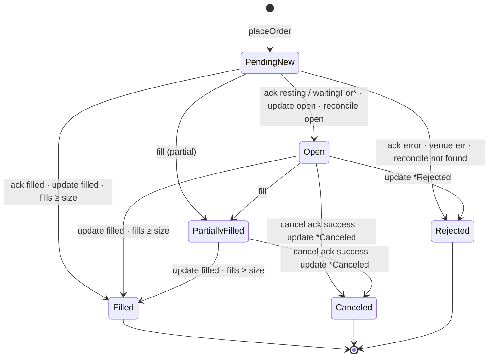

# Architecture

This document explains how hyperliquid-cpp is put together and why. For the
method-by-method reference see [API.md](API.md).

- [1. Design goals](#1-design-goals)
- [2. Layers](#2-layers)
- [3. Threading and the event loop](#3-threading-and-the-event-loop)
- [4. Market-data path](#4-market-data-path)
- [5. Order-management path](#5-order-management-path)
- [6. Order state machine](#6-order-state-machine)
- [7. Reliability design](#7-reliability-design)
- [8. Numeric model](#8-numeric-model)
- [9. Security](#9-security)
- [10. Testing strategy](#10-testing-strategy)

## 1. Design goals

1. **Correct before fast.** Every byte that is signed is verified against the reference SDK; every
   price and size is an exact decimal; order state is reconciled with the venue instead of guessed.
2. **Fast where it is free.** Parsing, book maintenance and signing are allocation-free after warm-up
   and measured continuously. Hyperliquid's block time (~0.2 s) dwarfs connector latency, so the
   library spends complexity on robustness, not on micro-optimisation of the network stack.
3. **Small surface, few dependencies.** One static library, three runtime dependencies (OpenSSL,
   libsecp256k1, simdjson — the latter two private and statically linked), no Boost, no Rust FFI.
4. **Embeddable.** No hidden threads (the only optional one is the nonce-pool refill thread you enable
   explicitly), no global state besides the log sink; the application owns the event loop and decides where it
   runs.

## 2. Layers

```
┌──────────────────────────────────────────────────────────────────────────────┐
│ Application / strategy                                                       │
├───────────────────────────────┬──────────────────────────────────────────────┤
│ MarketDataClient              │ ExchangeClient                    InfoClient │
│  subscriptions, books         │  order table, fills, positions,   /info REST │
│                               │  reconciliation, transport choice            │
├───────────────────────────────┼──────────────────────────────────────────────┤
│ OrderBook                     │ AssetRegistry (rounding) · RequestBuilder    │
│ WsMessageParser (simdjson)    │ actions:: (msgpack+JSON) · Signer (EIP-712)  │
│                               │ ExchangeResponse parser · NonceGenerator     │
├───────────────────────────────┴──────────────────────────────────────────────┤
│ WsSession (heartbeat, stale detection, backoff, subscription replay)          │
│ WebSocketClient (RFC 6455) · HttpClient (HTTP/1.1 keep-alive, ordered queue)  │
│ TlsStream (non-blocking TCP + OpenSSL)                                        │
├──────────────────────────────────────────────────────────────────────────────┤
│ EventLoop (epoll, timers, thread-safe task posting)                          │
├──────────────────────────────────────────────────────────────────────────────┤
│ core: Decimal · Cloid · Address · Error/Result · Log     crypto: Keccak256   │
└──────────────────────────────────────────────────────────────────────────────┘
```

Each layer is usable on its own: the signing layer can be dropped into an existing HTTP stack, the
parser and `OrderBook` can consume frames from any WebSocket implementation, and the transport layer
knows nothing about Hyperliquid.

## 3. Threading and the event loop

All I/O, timers and callbacks of every client attached to one `hl::EventLoop` run on the single thread
that calls `run()` / `runOnce()`. Consequences:

- **No locks** anywhere in the data path; listener callbacks may call any client method directly
  (e.g. place an order from `onBookUpdate`).
- Calls from other threads must be marshalled with `EventLoop::postThreadSafe()` (wakes the loop via an
  `eventfd`). `EventLoop::stop()` is also thread-safe and async-signal-safe.
- Deployment options:
  - **Dedicated thread**: `std::thread([&]{ loop.run(); })`, optionally pinned with
    `pthread_setaffinity_np`.
  - **Busy-poll** on an isolated core: `for(;;) loop.runOnce(0);` — removes `epoll_wait` sleep/wake-up
    jitter at the cost of one core.
  - **Embedded**: register `loop.fd()` in your own poller and call `runOnce(0)` when it is readable
    (or at least every few milliseconds, so timers fire).

Market data and order management may share one loop (simplest; callbacks are serialised) or run on
two loops/threads (isolation of a heavy market-data load from order entry). Objects must only be used
from the thread of the loop they were constructed with.

## 4. Market-data path

```
socket ─► TlsStream::doRead ─► WsFrameDecoder (zero-copy for unfragmented frames)
       ─► WsSession::onWsText (stale timer refresh)
       ─► WsMessageParser::parse  (memcpy into padded buffer → simdjson On-Demand;
                                   field-order independent; exact Decimal parsing;
                                   reused level/trade vectors)
       ─► MarketDataClient: l2Book → OrderBook::applySnapshot
                            bbo    → OrderBook::applyBbo (if newer than snapshot)
       ─► MarketDataListener::onL2Book / onBbo / … and onBookUpdate(book, kind)
```

**Why snapshot + overlay.** Hyperliquid publishes no incremental depth: `l2Book` is a full snapshot
(top 20, or top 5 on a `fast` subscription) and `bbo` fires on every best-price change in between.
The snapshot feeds are slow relative to `bbo` — measured on mainnet on 2026-09-19: 20-level every
~5.35 s, `fast` every ~0.54 s, `bbo` every 150–180 ms. `OrderBook` keeps the last
snapshot and rewrites its top from `bbo`: levels that the new best price moved through are removed,
the best level is inserted or resized, and stale opposite-side levels that would now cross are
dropped. The result is a consistent, never-crossed book whose top is as fresh as the venue allows and
whose depth is at most one block old.

On disconnect every book is cleared (`isValid() == false`) until the next snapshot, so a strategy can
never act on a book that silently stopped updating.

## 5. Order-management path

```
(full algorithm: ORDER_MANAGEMENT.md)
placeOrder(req) ─► validate (asset exists, px/sz valid per AssetInfo) ─► Order{PendingNew} in table
               ─► actions::order (msgpack + JSON from the same inputs)
               ─► RequestBuilder::payload: nonce, keccak(msgpack‖nonce‖vault), EIP-712, ECDSA
               ─► transport:  WS open?  {"method":"post","id":N,…}  + per-request timeout timer
                              otherwise POST /exchange (ordered keep-alive queue)
response        ─► parseExchangeResponse ─► per-order ActionStatus ─► state transition ─► onOrderUpdate
orderUpdates    ─► match by cloid (fallback oid) ─► transition ─► onOrderUpdate
userFills       ─► dedupe by tid ─► position = fill.endPosition ─► filled size/avg ─► onFill, onOrderUpdate
```

Start-up sequence (`ExchangeClient::start`): load `meta` (and optionally `spotMeta`) → seed positions
from `clearinghouseState` → connect the private WebSocket → subscribe `orderUpdates` and `userFills`
for the account (or vault) → both subscriptions acknowledged → `onReady()`. The same readiness gate is
re-evaluated after every reconnect.

The **cloid** is the primary key of every order. Orders placed by this client always carry a
session-unique cloid (random 64-bit session prefix + counter). Orders placed elsewhere (UI, another
process) are discovered through `orderUpdates`, tracked with a synthetic cloid and flagged
`external`; they can be observed and canceled (by oid).

## 6. Order state machine



Orthogonal flags: `cancelPending`, `modifyPending`. Rules that keep the table consistent when the
three sources (ack, `orderUpdates`, `userFills`) arrive in any order:

- **Fill quantity** is `max(Σ deduplicated fills, size reported filled by ack/update)` — neither a fast
  `filled` update nor a late fill can double count or regress it. The average price comes from fills
  when present, otherwise from the acknowledgement.
- **Terminal states are sticky**: a late `open` never resurrects a canceled order; `Filled` wins over
  `Canceled`.
- **Modify** keeps the cloid while the venue may assign a new oid. While a modify is in flight, a
  `canceled` update for the current oid is deferred (it is the replaced order), an `open` update with
  a new oid adopts that oid, and updates for retired oids are ignored afterwards. If the modify fails,
  the order is reconciled.
- **Unknown outcomes are never guessed**: a timeout, a transport failure, a failed cancel or a failed
  modify triggers `orderStatus(cloid)`; if the venue does not know a pending order it becomes
  `Rejected` ("order not found on venue"); query failures are retried every 2 s while the order is live.

## 7. Reliability design

| Failure | Handling |
|---|---|
| One unreachable address of a multi-address host (CDN edge) | `TlsStream` tries the next resolved address after a refusal or per-address timeout and rotates the starting address on every connect |
| WS drop / server close | `WsSession` reconnects with exponential backoff (250 ms → 10 s, configurable), replays subscriptions; books cleared; `onDisconnected`/`onConnected`. Routine, not exceptional: testnet closes every socket after ~10–12 min (`code 1000: Expired`) whatever the heartbeat does ([ORDER_MANAGEMENT §11](ORDER_MANAGEMENT.md#11-disconnects-and-reconnects)) |
| Half-open connection | application heartbeat `{"method":"ping"}` every 20 s; no inbound data for 60 s → forced reconnect |
| Action sent over a WS that dies | pending posts fail with `Transport`, affected orders are reconciled |
| No response to an action | per-request timer (`requestTimeoutMs`) → `Timeout` → reconcile |
| HTTP connection reuse race | a request never written is retried on a fresh connection (≤ 3 attempts); a written request is **never** replayed (actions are not idempotent) — it fails and is reconciled |
| Missed fills while disconnected | the `userFills` snapshot sent after resubscribing is diffed against seen trade ids; new fills are applied (the very first snapshot after start is historical and only seeds the dedupe set) |
| Orders changed while disconnected | on every re-ready, every live order is reconciled with `orderStatus` |
| Process crash with resting orders | `scheduleCancel` dead-man's switch (`ExchangeClient::scheduleCancel`, demo flag `--dead-man-switch`) |
| Request storms on permanent errors | local validation before signing; demo applies exponential back-off on consecutive rejections |
| Memory growth | terminal orders evicted after `terminalOrderRetentionMs`; trade-id dedupe set bounded (20 000) |
| Clock | nonces are `max(wall-clock ms, last + 1)` — strictly increasing even within one millisecond or if the clock steps back |

## 8. Numeric model

`hl::Decimal` is an int64 mantissa with 8 implied decimals (±92 billion), matching the maximum precision
Hyperliquid accepts. Venue strings are parsed exactly (≈8 ns, 3.5× faster than `strtod`), and the wire
form is produced exactly the way the reference SDK normalises numbers (`"50000"`, `"0.001"`), which
matters because the msgpack bytes that are signed contain these strings. Products and quotients use
128-bit intermediates. Doubles appear only in convenience accessors (`toDouble`, `spreadBps`) and in the
example strategy's pricing formula, never in data sent to the venue.

Price validity follows the venue rules implemented in `AssetInfo::roundPx`: at most 5 significant
figures (integers always allowed) and at most `6 − szDecimals` (perps) or `8 − szDecimals` (spot)
decimals; sizes have `szDecimals` decimals.

## 9. Security

- Use an **API (agent) wallet**: it can trade but not withdraw, and can be revoked in the Hyperliquid
  UI. `ExchangeConfig::accountAddress` names the master account it acts for.
- The private key lives only inside `hl::Signer`; it is wiped with `OPENSSL_cleanse` on destruction and
  never logged. The libsecp256k1 context is randomised against side channels.
- The optional precomputed-nonce pool keeps `k⁻¹` and `r·d` per entry in memory; entries are single-use, wiped on
  use, hedged against weak RNGs and disabled after `fork()` ([SIGNING.md §9](SIGNING.md#9-fast-signing-with-precomputed-nonces)).
- TLS peer verification and host-name checking are on by default (`TlsOptions::verifyPeer`); the CA
  bundle comes from the OpenSSL defaults (`SSL_CERT_FILE`/`SSL_CERT_DIR`) or `TlsOptions::caFile`.
- The examples read keys from environment variables or a key file — never from command-line
  arguments (which leak through `ps`).

## 10. Testing strategy

| Level | What | Where |
|---|---|---|
| Golden vectors | msgpack bytes, action hash, EIP-712 digest and (r, s, v) for orders, batches, triggers, cancels, cancel-by-cloid, modifies (by oid and cloid), scheduleCancel, updateLeverage, vaults, `expiresAfter`, mainnet/testnet — all generated with the official Python SDK | `tests/actions_test.cpp`, `tests/signer_test.cpp` |
| Parsers | real mainnet captures of every public channel, a full 758-frame session, synthetic private channels, malformed input | `tests/ws_message_parser_test.cpp` |
| Codecs | WebSocket framing (all length encodings, fragmentation, control frames, byte-by-byte feeding, re-entrancy), HTTP (content-length, chunked, close-delimited, split reads), Keccak (rate-boundary vectors) | `tests/ws_codec_test.cpp`, `tests/http_codec_test.cpp`, `tests/keccak_test.cpp` |
| Order book & rounding | overlay cases, capacity, VWAP, microprice; venue price/size rules | `tests/order_book_test.cpp`, `tests/asset_registry_test.cpp` |
| End-to-end | `ExchangeClient`, `MarketDataClient`, `InfoClient` and `HttpClient` over real sockets against `MockVenue` (HTTP + WebSocket server): lifecycle, partial fills, duplicates, rejections, batch-wide errors, cancel races, fast cancels, modify with oid change and trigger preservation, timeouts, HTTP transport, disconnect/reconnect reconciliation, missed and stale fills, external and adopted orders, agent wallets, liquidations, eviction, rate-limit budget, request ordering, 429 back-off, re-entrant callbacks, restart | `tests/exchange_client_test.cpp`, `tests/market_data_client_test.cpp`, `tests/info_client_test.cpp`, `tests/http_client_test.cpp` |
| Robustness | every fixture truncated at every byte length and 2 000 random single-byte mutations must not crash the parser | `tests/ws_message_parser_test.cpp` |
| Live | signing validated against the real testnet: the venue recovers exactly the signer address from our signatures over both WS `post` and HTTP | `hl_testnet_quoter`, see [TESTNET.md](TESTNET.md) |

### Verification matrix

| Build | Tests | Result |
|---|---|---|
| Clang 21, Release | 190 | all passed |
| GCC 11.5 (system), Release | 190 | all passed |
| GCC 15, Release | 190 | all passed |
| Clang 21, AddressSanitizer + UBSan | 190 | all passed, no reports |
| Clang 21, ThreadSanitizer (library tests; examples not built) | 184 | all passed, no reports |
| Docker build stage (Ubuntu 24.04, GCC 13) | 190 | all passed |

**Live check against Hyperliquid mainnet, real money, 2026-09-19.** Both product types, every perp
`szDecimals` from 0 to 5, both transports; every run ended with the account flat and no orders
left.

| Instrument | Kind, szDecimals | What it adds | Result |
|---|---|---|---|
| `BTC` | perp, 5 | `--taker`: real fill, `updateLeverage`, reduce-only close | **16/16** |
| `ETH` | perp, 4 | | **14/14** |
| `XMR` | perp, 3 | | **14/14** |
| `ZEC` | perp, 2 | four-figure price | **14/14** |
| `NEAR` | perp, 1 | | **14/14** |
| `XRP` | perp, 0 | whole-unit sizes — the rounding edge case | **14/14** |
| `@107` HYPE/USDC | spot, 2 | `--taker` + `--expiry-ms`: two real fills, `expiresAfter` | **15/15** |
| `@142` UBTC/USDC | spot, 5 | five-figure price | **13/13** |
| `@151` UETH/USDC | spot, 4 | **`--transport http`**, all actions over HTTP | **13/13** |
| `@156` USOL/USDC | spot, 3 | | **13/13** |
| `PURR/USDC` | spot, 0 | the one spot pair named by pair rather than `@index` | **13/13** |

Aggregate latency over those runs — 120 signed actions, measured by the client's own counters from
the benchmark stand in Tokyo ([BENCHMARKS.md](BENCHMARKS.md#environment)): build+sign **0.001 ms**
mean (max 0.009), order round trip **435 ms** (311–763), cancel **402 ms**, modify **414 ms**.

| Live check against Hyperliquid testnet | Result |
|---|---|
| `hl_live_check --taker --expiry-ms 30000` (WebSocket transport, `expiresAfter` on every action) | **16/16 steps passed** — resting order, `orderStatus`/`frontendOpenOrders`, modify with oid change, cancel, batch + cancelAll, post-only rejection, local validation, IOC fill with fee and position, reduce-only close, `scheduleCancel` (venue requires $1 M volume), `updateLeverage`, forced reconnect + reconciliation, clean exit |
| `hl_live_check --taker --transport http` | **16/16 steps passed**, 13/13 actions over `POST /exchange` |
| **Eight-hour soak**, quoting both sides and amending ~1/s (2026-09-20) | 7 594 actions (227 placements, 7 366 amendments), 233 maker fills, $4 238 traded, 43 venue-forced reconnects, 271 reconciliations, **0 timeouts**, **0 orders left unmanaged**, flat at the end with nothing resting. Memory flat at 12.5 MB. Five order-tracking defects were found and fixed during the runs that led up to it |
| Quoter, 70 s quoting at the touch | 4 maker fills (0.0075 ETH each, fee 0.002962 USDC = 1.5 bps), inventory skew applied, orders canceled on exit |
| Quoter, 10 min at 8 bps from mid | 32 amendments against 2 placements, 0 rejects, 0 errors, no fills (quotes behind the touch) |
| Fast cancels (`f: true`) | accepted by the venue on single and batch cancels |
| Order priority fee (`grouping:{"p":10000}`) | encoding accepted; rejected semantically ("Insufficient delegatable balance for priority order"), which is the expected answer for an account without staking balance |
| Market data (`l2Book`, `bbo`, `trades`, `activeAssetCtx`) | books built, 0 parse errors |
| Mainnet market-data replay parse | 758 frames, 0 parse errors |
| Signed orders, RFC 6979, WebSocket `post` and HTTP | venue recovered exactly the local signer address |
| Signed orders, precomputed nonces, WebSocket `post` and HTTP | venue recovered exactly the local signer address; 12/12 signatures via the pool, 0 fallbacks |
| Connects after the multi-address fix | 4/4 successful |

Live checks used unfunded random keys, so the venue rejected the orders with
`User or API Wallet <signer> does not exist` — which proves the full encoding/hash/signature chain, but not
fills. Fill handling is covered end-to-end by the mock-venue tests.

All tests also run under AddressSanitizer + UndefinedBehaviorSanitizer (`scripts/test.sh asan`).

---

© 2026 Denis Tishkov <denis8825@ya.ru>. hyperliquid-cpp is licensed, not sold — see [LICENSE](../LICENSE).
