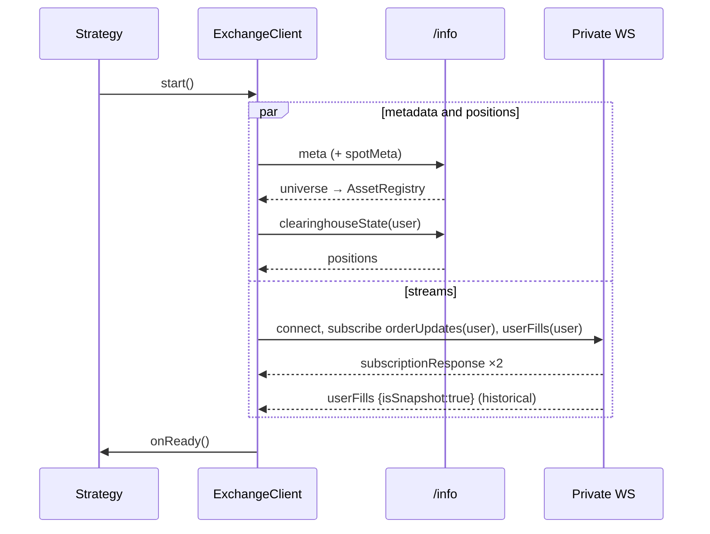
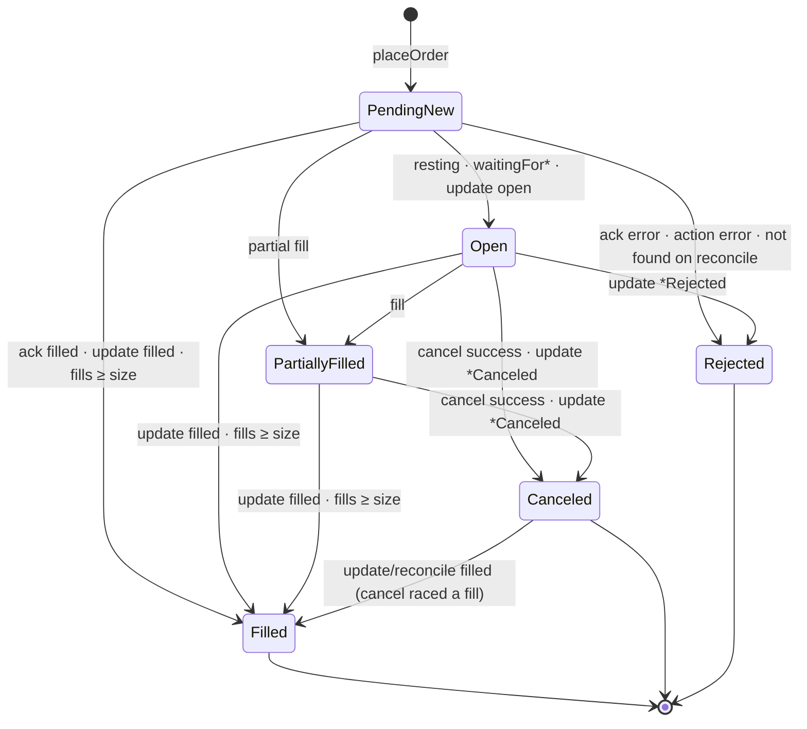

# Order management — how `ExchangeClient` works

This document describes the order-management (OM) algorithm step by step: what happens between
`placeOrder()` and the order reaching a final state, how the client merges three asynchronous sources of
truth into one consistent order table, and how it recovers from lost messages, timeouts and disconnects.
Method signatures are in [API.md §5](API.md#5-order-management); the signing math is in
[SIGNING.md](SIGNING.md).

- [1. Model](#1-model)
- [2. Start-up](#2-start-up)
- [3. Submitting an action](#3-submitting-an-action)
- [4. Correlating responses](#4-correlating-responses)
- [5. The three sources of truth](#5-the-three-sources-of-truth)
- [6. State machine rules](#6-state-machine-rules)
- [7. Fills, filled size and positions](#7-fills-filled-size-and-positions)
- [8. Cancels](#8-cancels)
- [9. Modify (amend in place)](#9-modify-amend-in-place)
- [10. Reconciliation](#10-reconciliation)
- [11. Disconnects and reconnects](#11-disconnects-and-reconnects)
- [12. External orders](#12-external-orders)
- [13. Housekeeping](#13-housekeeping)
- [14. Latency of the order path](#14-latency-of-the-order-path)
- [15. Worked timelines](#15-worked-timelines)

## 1. Model

```
                 ┌───────────────────────── ExchangeClient ─────────────────────────┐
placeOrder ────► │ validate ─► order table (cloid → Tracked) ─► sign ─► transport   │ ──► venue
                 │                     ▲            ▲             ▲                  │
                 │    acknowledgement ─┘            │             │                  │ ◄── post / HTTP response
                 │    orderUpdates ─────────────────┘             │                  │ ◄── private WebSocket
                 │    userFills (dedupe, positions) ──────────────┘                  │ ◄── private WebSocket
                 │    orderStatus (reconcile) ◄───── timeouts / errors / reconnect   │ ◄── /info
                 └──────────────────────────────────────────────────────────────────┘
                         │ onOrderUpdate(order) · onFill(fill) · onReady · onDisconnected
                         ▼
                      strategy
```

- **Key.** Every order is identified by a 128-bit client order id (**cloid**). The client generates it
  (`nextCloid()`: a random 64-bit session prefix and a counter) unless the request supplies one. The exchange
  order id (**oid**) is learned later and can change on modify; the cloid never does.
- **Table.** `cloid → Tracked`, where `Tracked` holds the public `Order` plus private bookkeeping: the sum and
  notional of applied fills, the filled size reported by acknowledgements/updates, oids retired by modifies,
  and a "canceled during modify" flag. A secondary index `oid → cloid` resolves messages that carry only an oid.
- **Single thread.** Every mutation happens on the event-loop thread, so the table needs no locks. Listener
  callbacks run synchronously after each mutation and may call back into the client.

## 2. Start-up

`start()` runs four independent steps; the client becomes **ready** when all have completed.

| Step | Request | Result | On failure |
|---|---|---|---|
| Asset metadata | `/info {"type":"meta"}` (+ `spotMeta` if `loadSpotAssets`) | `AssetRegistry`: name → asset id, `szDecimals`, max leverage, spot base token | `onError`, retried every 2 s |
| Positions | `/info {"type":"clearinghouseState","user":…}` | initial per-coin position | warning; positions then come from fills only |
| Spot balances (if `loadSpotAssets`) | `/info {"type":"spotClearinghouseState","user":…}` | starting position of every spot market, from the balance of its base token | warning; spot positions start empty |
| Signer role | `/info {"type":"userRole","user":<signer>}` | detects an API (agent) wallet and its master account | debug log |
| Order stream | WS subscribe `orderUpdates` for the user | subscription acknowledged | reconnect loop |
| Fill stream | WS subscribe `userFills` for the user | subscription acknowledged; first message is a snapshot of recent fills | reconnect loop |
| Account events (if `subscribeUserEvents`) | WS subscribe `userEvents` | liquidations and venue-initiated cancels (channel `user`) | reconnect loop |
| Existing orders (if `adoptExistingOrders`) | `/info {"type":"frontendOpenOrders","user":…}` once after ready | orders left resting by a previous process are adopted (`Order::external`) | warning |

"User" is the vault address if one is configured, otherwise the account address (for an agent wallet, the
master account — never the agent's own address).

**Agent-wallet check.** At start-up the client also queries `{"type":"userRole","user":<signer>}`. If the
signing key is an API (agent) wallet, the venue reports its master account. With `accountAddress` left empty
the client adopts that master (and resubscribes the user streams to it); with a different one configured it
logs an error and calls `ExchangeListener::onError` — otherwise orders would be booked on the master while
updates, fills and positions were read from the wrong address.



Order entry is accepted as soon as metadata is loaded (`checkReady`), even before the streams are up — such
actions go over HTTP. Strategies should normally wait for `onReady()`.

## 3. Submitting an action

`placeOrder` / `placeOrders`:

1. **Validate locally** — nothing is signed or sent if any order fails:
   coin exists and is not delisted; price and size positive; price valid for the asset
   (≤ 5 significant figures, ≤ `6 − szDecimals` decimals for perps / `8 − szDecimals` for spot); size has
   ≤ `szDecimals` decimals; trigger price valid; cloid not already in the table.
   Failure → the call returns `Error{Rejected}` with the nearest valid value in the message.
2. **Insert** one `Order{state = PendingNew}` per request into the table.
3. **Encode** the action once as MessagePack (for the signature) and JSON (for the wire) — see
   [SIGNING.md §2](SIGNING.md#2-action-encoding-messagepack). A batch of N orders is **one** action with
   **one** signature and one nonce.
4. **Nonce**: `max(wall-clock ms, previous + 1)` — strictly increasing per client.
5. **Sign**: `keccak(msgpack ‖ nonce ‖ vault flag)` → EIP-712 digest → ECDSA (precomputed nonce if the pool
   is enabled).
6. **Choose transport**:
   - `ActionTransport::WebSocket` and the private socket is open → frame
     `{"method":"post","id":<requestId>,"request":{"type":"action","payload":…}}`, built in a single
     allocation, and arm a timer of `requestTimeoutMs`;
   - otherwise → `POST /exchange` on the ordered keep-alive HTTP queue (its own timeout
     `http.requestTimeoutMs`). HTTP requests on one connection are strictly sequential, so actions keep their
     submission order.
7. **Register** a pending entry `requestId → {kind, cloids in action order, modify targets, callback}` and
   return the cloids.

`cancel`, `cancelAll`, `cancelByOid`, `modify`, `scheduleCancel`, `updateLeverage`, `updateIsolatedMargin`,
`reserveRequestWeight`, `noop` and `submitAction` follow the same steps 3–7 with their own validation.

**Rate-limit accounting.** Each submission counts one *address* unit per order or cancel entry (one for other
actions) into `Stats::addressUnitsUsed`; `rateLimitRefreshMs` re-reads the venue's own figure (`userRateLimit`)
so `rateLimitStatus()` stays close to the truth, and the client warns once when less than
`rateLimitWarnFraction` of the budget is left. `cancelAll` splits into actions of at most 40 entries — the size
the venue charges as one IP-weight unit. A 429 pauses that HTTP queue for `Retry-After`; the request itself
fails and is never replayed.

**Fast cancels.** Cancels carry the venue's `fast` flag unless the order is a trigger order, which the venue
refuses to fast-cancel. The flag is documented for future mempool prioritisation of cancels.

**Per-action expiry.** With `actionExpiryMs` every action carries `expiresAfter = now + N` and the venue drops
it if it arrives later — a guard against a stalled connection delivering stale orders (expired actions cost 5×
the usual address budget).

## 4. Correlating responses

| Transport | Correlation |
|---|---|
| WebSocket post | `{"channel":"post","data":{"id":N,…}}` → pending entry `N` |
| HTTP | the response is delivered to the callback of the request that was written (one in flight per connection) |

`completeAction(id, result)`:

1. Look up and remove the pending entry. **Not found** → the action already timed out or its socket died;
   the late response is ignored because reconciliation has taken or will take over.
2. Cancel the timeout timer; count errors and timeouts.
3. Apply the result to every cloid of the action ([§5](#5-the-three-sources-of-truth)).
4. Call the action's callback (for `scheduleCancel`, `updateLeverage`, `submitAction`).

A successful response contains one status per entry of the action, in request order:
`{"resting":{"oid"}}`, `{"filled":{"totalSz","avgPx","oid"}}`, `"waitingForFill"`, `"waitingForTrigger"`,
`"success"` or `{"error":"…"}`. The i-th status belongs to the i-th cloid of the pending entry.

## 5. The three sources of truth

The same order is reported by three independent channels whose relative order is **not** guaranteed:

| Source | Latency | Carries | Can be lost? |
|---|---|---|---|
| **Acknowledgement** (post/HTTP response) | one round trip | immediate outcome of the action | yes: timeout, disconnect |
| **`orderUpdates`** | pushed after the block | lifecycle status (`open`, `filled`, `canceled`, `*Canceled`, `*Rejected`, `triggered`) with limit price and sizes | yes, while disconnected |
| **`userFills`** | pushed after the block | every execution with trade id, price, size, fee, position before the fill | no: re-sent in the snapshot after reconnect |

The client applies every message as soon as it arrives and makes the result independent of the order of
arrival using the rules below.

**Batch-wide rejections.** When pre-validation fails, the venue answers with one error for the whole payload.
That status is applied to every order of the batch (all `Rejected`); if the status list is shorter than the
batch for any other reason, the remaining orders are reconciled instead of being left pending forever.

### Acknowledgement of an order action

| Status | Effect |
|---|---|
| `resting` | store oid; `PendingNew` → `Open` (or `PartiallyFilled` if fills already arrived) |
| `filled` | store oid; record `ackFilledSz = totalSz`, `ackAvgPx = avgPx`; state → `Filled` |
| `waitingForFill`, `waitingForTrigger` | `PendingNew` → `Open` |
| `error` | `lastError = message`; `PendingNew` → `Rejected` |
| whole action failed with `Venue` / `Parse` / `Http` error | every `PendingNew` order of the action → `Rejected` |
| whole action failed with `Transport` / `Timeout` | state unchanged (**outcome unknown**) → reconcile each order |

### `orderUpdates`

1. Find the order by cloid; if absent, by oid; if still absent, create an **external** order ([§12](#12-external-orders)).
2. Resolve oid changes caused by modify ([§9](#9-modify-amend-in-place)).
3. Apply the status:

| Status | Effect (only if the order is not terminal, see §6) |
|---|---|
| `open`, `triggered` | `px ← limitPx`, `origSz ← origSz`; `PendingNew`/`Open` → `Open` or `PartiallyFilled` |
| `filled` | `ackFilledSz ← max(ackFilledSz, origSz)`; state → `Filled` |
| `canceled`, `*Canceled`, `scheduledCancel` | state → `Canceled`; non-plain reasons (e.g. `marginCanceled`) kept in `lastError` |
| `rejected`, `*Rejected` | state → `Rejected`; reason in `lastError` |
| unknown string | `lastError = status`, state unchanged |

### `userFills` → see [§7](#7-fills-filled-size-and-positions).

### `userEvents` (channel `user`)

Enabled by `subscribeUserEvents`. Liquidations reach `ExchangeListener::onLiquidation` — they appear in no
other stream — funding payments reach `onFunding`, and a cancel performed by the venue itself marks the
matching order `Canceled` with `lastError = "canceledByVenue"`.

## 6. State machine rules



1. **Terminal states are sticky.** Once `Filled`, `Canceled` or `Rejected`, only a `filled` status is still
   applied (an upgrade: a cancel acknowledged locally while the venue had already matched the order). A late
   `open` can never resurrect an order.
2. **Flags are orthogonal to state.** `cancelPending` and `modifyPending` mark in-flight requests and are
   cleared by their acknowledgement, by a terminal update, or by reconciliation.
3. **Unknown means unknown.** The client never infers the outcome of an action it has no response for; it asks
   the venue ([§10](#10-reconciliation)).
4. **Every change is published.** Each applied message that touches an order ends with
   `onOrderUpdate(order)`; the `Order` reference is valid until eviction ([§13](#13-housekeeping)).

## 7. Fills, filled size and positions

For each `userFills` message:

1. **Historical snapshot.** The first snapshot after `start()` describes fills that happened before the
   process started — they are already reflected in `clearinghouseState`. Their trade ids are only recorded.
2. **Deduplication.** A fill whose `tid` was seen before is skipped. The last 20 000 tids are remembered (FIFO).
   Snapshots received after a reconnect therefore apply exactly the fills missed while disconnected.
3. **Position.** `position[coin] = startPosition ± sz` (`Fill::endPosition()`): the venue's own position
   before the fill plus this fill, so the tracked position self-corrects on every execution instead of
   accumulating drift.
4. **`onFill(fill)`** — also for fills of orders not in the table.
5. **Order.** Find by cloid, else by oid; add `sz` to `fillSum` and `px·sz` to the notional (128-bit), then

```
filledSz  = max(fillSum, ackFilledSz)
avgFillPx = fillSum > 0 ? notional / fillSum : ackAvgPx
state     = filledSz ≥ origSz ? Filled : PartiallyFilled      (if not terminal)
```

   followed by `onOrderUpdate`.

**Timing.** The acknowledgement of an immediately executing order reports the fill at once, while the
`userFills` message that carries the trade id, fee and `startPosition` arrives with the next block — about
1–2 s later on testnet. `Order::state` and `filledSz` therefore become final before `position(coin)` moves.
A strategy that sizes on inventory must read the position after the fill callback, not right after the
acknowledgement.

**Why `max`.** An IOC that fills immediately produces an acknowledgement `filled{totalSz}`, a `filled`
order update and one or more fills, in any order. Adding them would double count; taking the maximum of "sum of
individual executions" and "size the venue says is filled" is correct regardless of arrival order and never
decreases.

## 8. Cancels

| Call | Wire action | Notes |
|---|---|---|
| `cancel(cloid)` for own order | `cancelByCloid` | works even while the order is `PendingNew` (no oid yet) |
| `cancel(cloid)` for an external order | `cancel {a, o}` | external orders may lack a cloid |
| `cancelByOid(coin, oid)` | `cancel {a, o}` | also for orders unknown to the table |
| `cancelAll(coin)` | one `cancelByCloid` batch (+ one `cancel` batch for external orders) | skips orders already `cancelPending` |

Preconditions: the order exists, is live and has no cancel in flight. `cancelPending` is set before sending.

Acknowledgement: `success` → `Canceled` (unless already terminal). `error` — typically
*"Order was never placed, already canceled, or filled"* — is ambiguous, so the order is **reconciled**: the
venue decides whether it was filled or canceled. Transport failure → reconcile.

## 9. Modify (amend in place)

`modify(cloid, px, sz)` sends `batchModify {oid, order}` with the same cloid, side, tif and reduce-only flag.
Preconditions: live, acknowledged (oid known), no cancel or modify in flight, new price/size valid.

The venue implements a modify as cancel + new order: the **oid may change**, and `orderUpdates` may report
`canceled` for the old oid and `open` for the new one — before or after the acknowledgement. The client keeps
the order continuous:

| Situation (modify in flight) | Handling |
|---|---|
| update `canceled` for the **current** oid | deferred: `canceledDuringModify = true`, not applied |
| update `open`/`filled`/`triggered` with a **new** oid | adopt the new oid, retire the old one |
| update with another status for a new oid | ignored (the ack will tell) |
| ack success `resting{oid}` | `px`, `origSz` ← targets; retire old oid if different; state as for an order ack; `lastError` cleared |
| ack error, or transport failure, or `canceledDuringModify` without success | reconcile |
| later update for a **retired** oid | ignored |

## 10. Reconciliation

`reconcile(cloid)` queries `/info {"type":"orderStatus","user":…,"oid":<oid>}` with the **oid** of the
order whenever one is known, and falls back to `"oid":"0x<cloid>"` only for an order whose
acknowledgement never arrived and which therefore has no oid yet.

> **Why not always by cloid.** The venue resolves a cloid to the *first* order placed with it, while
> `modify` carries the cloid over to a new oid. After an amendment a cloid probe therefore answers
> `canceled` about the superseded generation while the live order is resting. Believing that marks a
> working order terminal and leaks it: the strategy stops managing an order that is still on the
> venue. An answer about an oid other than the tracked one is ignored for the same reason.

After a reconnect the client asks for the whole list first (`frontendOpenOrders`) and only probes the orders
missing from it individually — one request instead of one per live order. Anything in that list the client
cannot account for is **adopted** (when `adoptExistingOrders` is set, the default): an order whose
acknowledgement went down with the socket then reappears in `liveOrders()` and `cancelAll()` instead of
resting unmanaged.

| Trigger | Why |
|---|---|
| order action timed out / socket died | the order may or may not exist |
| cancel acknowledged with an error | filled or canceled? |
| modify failed or was interrupted | which version of the order is live? |
| client became ready again after a reconnect | anything may have happened while disconnected |
| an open order on the venue matches nothing in the table | it is adopted, not ignored |

| Venue answer | Effect |
|---|---|
| `order` with status | apply status (terminal rules hold), store oid, update price/size |
| `unknownOid` | a `PendingNew` order becomes `Rejected` ("order not found on venue"); other states unchanged |
| request failed | retried every 2 s while the order is live and the client runs |

Timeout behaviour in numbers (defaults): a post without an answer is resolved after at most
`requestTimeoutMs` (10 s) + one `/info` round trip.

## 11. Disconnects and reconnects

```mermaid
sequenceDiagram
    participant X as ExchangeClient
    participant W as Private WS
    participant I as /info
    W--xX: connection lost
    X->>X: ready = false; pending WS posts fail (Transport) → reconcile their orders
    X-->>X: onDisconnected(reason)
    Note over X,W: WsSession backoff 250 ms → 10 s, next resolved address first
    X->>W: reconnect, resubscribe orderUpdates + userFills
    W-->>X: subscriptionResponse ×2
    W-->>X: userFills snapshot → unseen tids applied
    X->>I: orderStatus for every live order
    X-->>X: onReady()
```

**The venue closes connections on its own, and a heartbeat does not prevent it.** On **testnet** every
WebSocket is closed after roughly 10–12 minutes with `code 1000: Expired`, busy or idle, pinged or not
(measured 2026-09-20 on three parallel sockets: 613 s, 662 s, 689 s, 691 s with `{"method":"ping"}` every
20 s; **mainnet** kept the same three sockets open for the whole 25-minute measurement). What the ping
does buy is the other failure: a socket that never pings is dropped by the venue without a close frame
(code 1006) after 7–10 minutes. `WsSessionOptions::pingIntervalMs` is 20 s by default, well inside the
venue's 60 s idle rule.

So a long-running process reconnects every few minutes by design, and **every reconnect is a moment
where an action in flight fails with `Transport` and its order must be reconciled** ([§10](#10-reconciliation)).
That is the path to get right; suppressing the reconnect is not an option the venue offers.

- Actions submitted while the socket is down go over HTTP (WebSocket transport) — order entry keeps working.
- Stale connections (no inbound data for `staleTimeoutMs`) are closed and reconnected the same way.
- Nothing is replayed: an action written to a dead connection is never re-sent (actions are not idempotent);
  its effect is established by reconciliation.

## 12. External orders

Orders placed by another process or the web UI appear in `orderUpdates` with an unknown cloid/oid. The client
tracks them with the cloid from the update or, if absent, a synthetic `Cloid{0xFFFFFFFFFFFFFFFF, oid}`, sets
`Order::external = true`, fills in coin, asset, side, price and size, and keeps them up to date. They can be
canceled (by oid) and are included in `liveOrders()`. Positions include their fills.

## 13. Housekeeping

- Terminal orders stay in the table for `terminalOrderRetentionMs` (default 60 s) after their last change so
  late lookups work, then a 10 s sweep evicts them together with their oid index entries.
- Trade-id memory is bounded (20 000).
- `stop()` unsubscribes nothing (the socket is closed), cancels timers and drops pending actions without
  callbacks. Resting orders stay on the venue — cancel them first, or rely on `scheduleCancel`.
- Dead-man's switch: `scheduleCancel(now + T)` refreshed periodically makes the venue cancel all orders if the
  process stops refreshing (the demo refreshes 90 s every 30 s).

## 14. Latency of the order path

Measured on the benchmark stand (AWS `c8a.2xlarge`, AMD EPYC Zen 5, isolated core, Clang 21) — see
[BENCHMARKS.md](BENCHMARKS.md#environment).

| Stage of `placeOrder` → bytes queued on the socket | Time |
|---|---|
| validation, table insert, cloid | not benchmarked separately |
| MessagePack + JSON encoding | 0.19 µs |
| action hash (1 Keccak permutation) | 0.26 µs |
| EIP-712 digest (2 Keccak permutations) | 0.51 µs |
| ECDSA — RFC 6979 (default) | 14.7 µs |
| ECDSA — precomputed nonce (`precomputedNonces > 0`) | **0.04 µs** |
| frame assembly, hex, nonce, WebSocket masking | ≈ 0.17 µs |
| **total, default** (benchmark `Order_EndToEnd_SignedPayload`) | **≈ 15.9 µs** |
| **total, precomputed nonces** (benchmark `Order_EndToEnd_Precomputed`) | **≈ 1.17 µs** |

Keccak dominates the optimised path (two thirds of it) and scales with single-core speed; `-march=native`
(`HL_NATIVE=ON`) takes the total to ≈ 1.05 µs on the same CPU. Everything after the bytes are queued —
TLS encryption, kernel, network, and the venue's block time (~0.2 s) — is outside the client.

## 15. Worked timelines

**Post-only order that rests, fills partially, then fully**

| # | Arrives | Order after |
|---|---|---|
| 1 | `placeOrder` | `PendingNew`, oid 0 |
| 2 | ack `resting{oid:1000}` | `Open`, oid 1000 |
| 3 | fill tid 10, 0.001 of 0.002 | `PartiallyFilled`, filled 0.001, position +0.001 |
| 4 | fill tid 10 again (snapshot after reconnect) | unchanged (duplicate tid) |
| 5 | update `filled` | `Filled`, filled 0.002 (from update) |
| 6 | fill tid 11, 0.001 | `Filled`, filled max(0.002, 0.002) = 0.002, avg price from both fills |

**Cancel racing a fill**

| # | Arrives | Order after |
|---|---|---|
| 1 | `cancel(cloid)` | `Open`, cancelPending |
| 2 | ack `error: already canceled, or filled` | cancelPending cleared, reconcile started |
| 3 | fill arrives | `Filled` |
| 4 | reconcile answer `filled` | `Filled` (unchanged) |

**Order sent while the connection dies**

| # | Arrives | Order after |
|---|---|---|
| 1 | `placeOrder` → WS post | `PendingNew` |
| 2 | socket closed | action fails `Transport`; reconcile → `unknownOid` or real status |
| 3a | venue never received it | `Rejected`, "order not found on venue" |
| 3b | venue accepted it | `Open` with oid (or `Filled`) — and `orderUpdates` confirm after resubscription |

---

© 2026 Denis Tishkov <denis8825@ya.ru>. hyperliquid-cpp is licensed, not sold — see [LICENSE](../LICENSE).
